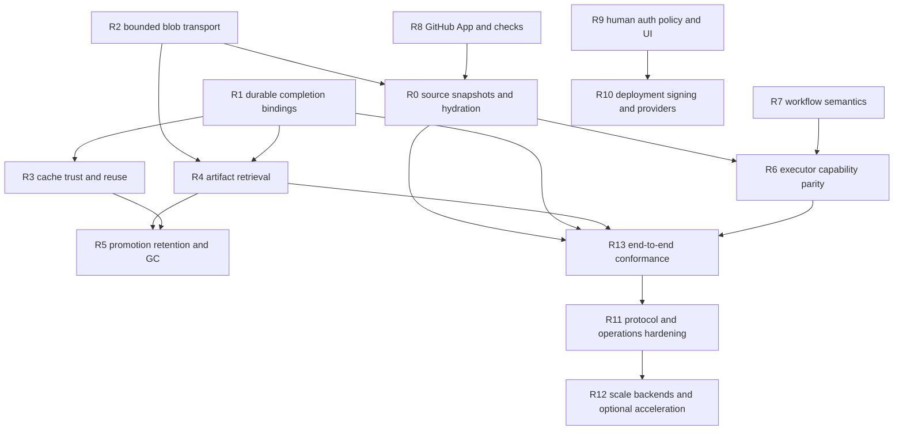

# Runtrue version-one remainder: design and implementation plan

Status: historical implementation plan, superseded as a current-state audit on
2026-07-15

This document is retained to explain the original dependency graph and design
intent. Many audited starting-state statements below were subsequently
implemented and must not be used as current release status. The current v0.x
support boundary is maintained in the repository `README.md`, `CHANGELOG.md`,
the operations runbooks, and executable CI/release gates. Unfinished version-one
items remain useful roadmap input only after they are revalidated against the
current tree.

This document turns the remaining boundaries in the technical design into an
ordered engineering program. It is intentionally more concrete than the
roadmap: each workstream names the protocol and persistence changes, module
boundaries, recovery behavior, tests, and acceptance gates needed to call the
feature complete.

The current tree has strong compiler, trust, fencing, storage, executor, and
single-node foundations. It is not yet an end-to-end version-one product. In
particular, remote workspaces are not hydrated with source, completion rejects
committed cache/artifact IDs, and the blob RPCs buffer complete blobs despite
using streaming protobuf shapes. Those are correctness blockers, not roadmap
polish.

## 1. Scope and completion levels

Work is divided into four levels so that a passing unit suite is not confused
with product completion.

- **L0 — primitive complete:** the isolated domain library and its adversarial
  tests exist.
- **L1 — adapter complete:** the primitive is wired into one caller with exact
  authorization, recovery, and configuration.
- **L2 — end-to-end complete:** the public CLI/API through a real runner and
  durable restart path is tested.
- **L3 — release complete:** operations, retention, observability,
  compatibility, documentation, and performance gates pass.

No version-one checklist item is complete below L2. Security-, storage-, and
protocol-sensitive items require L3.

### 1.1 Audited starting state

The plan is based on these concrete repository boundaries:

- `WorkspaceManager::create` creates an empty lease directory and
  `RunnerDaemon::prepare_offer` invokes the executor without a source hydration
  phase.
- `RunnerControlService::complete_authenticated` rejects any non-empty
  `artifact_ids` or `cache_entry_ids`, although the runner now submits both.
- `runner::data_plane::upload_digest`, `TonicRunnerBroker::download_blob`, and
  the server download handler buffer complete blobs.
- the remote server derives every cache trust domain as `RunPrivate`;
  quarantine/branch/verified cache primitives are not selected end to end.
- artifact and cache promotion HTTP routes create detached pending records;
  they do not validate or promote the immutable store object.
- the new blob/cache/artifact RPC path has contract and primitive tests but no
  configured-data-plane gRPC test from a real runner through completion.
- server authorization uses one embedded Cedar permit, while stored policy
  versions do not drive live evaluation.
- the SCM worker reads operator-refreshed mirrors and does not fetch through the
  hardened mirror manager or publish provider checks.

These facts should become regression tests before their implementations are
changed.

### 1.2 Priority classes

- **P0 correctness blockers:** existing advertised behavior cannot complete or
  violates a resource-bound invariant.
- **P1 version-one blockers:** required for the release checklist and normal CI
  use, but does not invalidate an unrelated existing flow.
- **P2 production readiness:** required before production recommendation.
- **P3 scale and follow-on:** optional backends and ecosystem expansion after
  the minimal version-one mode is sound.

## 2. Non-negotiable invariants

Every implementation below preserves these rules:

1. Source, plan, policy, lock, runner, cache, artifact, and approval identities
   are content-addressed or versioned and bound before execution.
2. The control plane never executes repository or workload code and never
   receives a container runtime or KVM device.
3. A stale lease, attempt, installation epoch, certificate, or guest session
   cannot read secrets/source/cache or publish logs/cache/artifacts/completion.
4. The runner never receives ambient provider, object-store, SCM, or signing
   credentials.
5. Cache failure is a bounded miss. Artifact/source integrity failure is a
   terminal correctness error.
6. Streaming data paths use constant memory with configured byte, time,
   concurrency, and disk-staging bounds.
7. No external side effect is acknowledged until its replay/reconciliation
   identity is durable.
8. Cross-tenant authorization is resolved before metadata or existence is
   disclosed.
9. New protocol generation N ships with server support for N-1 and explicit
   downgrade behavior; an existing wire generation is never silently redefined
   after release.
10. Unsupported behavior fails before workload side effects and never falls
    back to native execution or ambient credentials.

## 3. Dependency graph and milestones



Milestones are release gates, not calendar estimates:

| Milestone | Required workstreams | Exit condition |
| --- | --- | --- |
| M0 Data correctness | R1, R2, focused R13 | Cache/artifact jobs complete; blob memory is bounded; restart/replay tests pass. |
| M1 Usable remote CI | R0, R8 source-fetch subset, R13 | A GitHub push builds its exact commit on a clean remote runner. |
| M2 Durable outputs | R3, R4, R5 | Cross-run cache works by trust scope; artifacts can be downloaded, scanned, promoted, retained, and restored from backup. |
| M3 Executor parity | R6, R7 core | Supported OCI/Wasm/Firecracker profiles run the conformance corpus with enforced capabilities. |
| M4 Product control plane | R8, R9, R10 | Users can install SCM, review risk, approve, observe, and deploy without bootstrap-only workflows. |
| M5 Version-one release | R11, R13, selected R12 | N/N-1, security, chaos, performance, packaging, and recovery gates pass. |

### 3.1 Workstream index

| ID | Priority | Deliverable | Depends on | Principal hotspots |
| --- | --- | --- | --- | --- |
| R0 | P0 | Exact source snapshots and hydrated remote workspaces | R2 interface | `runtrue-git`, compiler context, SCM worker, runner daemon, storage |
| R1 | P0 | Durable cache/artifact completion bindings | none | control-plane migration/store, cache/artifact commit handlers, completion |
| R2 | P0 | Constant-memory object transfer and cache circuit breaker | none | storage, runner broker/transport, runner service, protobuf v2 |
| R3 | P1 | Cross-run trust-scoped cache and evidence promotion | R1, R2 | cache model/store, server identity derivation, compiler cache material |
| R4 | P1 | Artifact catalog, provenance, report, and download APIs | R1, R2 | control plane, artifact store, Axum API, report ingestion |
| R5 | P1/P2 | Scan/promotion worker, retention, GC, quotas, backup | R3, R4 | durable tasks, CAS stores, backup, deployment assets |
| R6 | P1 | Wasm/OCI/Firecracker/Native capability parity | R0, R2, R7 core | executor crates, runner adapters, guest protocol, network provider |
| R7 | P1 | Dynamic matrices, finalizers, outputs, triggers, services | R0 for remote tests | AST/IR/schema, compiler, engine, control-plane scheduler |
| R8 | P1 | GitHub App fetch, source refresh, checks, trigger reconciliation | R0 builder | SCM/Git crates, SCM worker, provider credentials, durable tasks |
| R9 | P1 | Human SSO, policy lifecycle, approval administration, UI | none | auth/policy crates, control-plane identity tables, Axum/UI |
| R10 | P1 | Vault, signing, environments, deployment and rollback | R4, R9 | secrets/signing/deploy crates, runner broker, APIs |
| R11 | P2 | N/N-1, packaging, API contract, recovery hardening | M0-M4 | protocol adapters, deployment, OpenAPI, backup |
| R12 | P3/selected P2 | PostgreSQL/S3/HA and acceleration backends | stable M2 contracts | store traits, workers, cache agents, BuildKit/OCI/Firecracker |
| R13 | all | End-to-end, fuzz, chaos, isolation, performance evidence | follows each lane | integration harnesses, CI, fixtures, release evidence |

## 4. P0 workstreams

### R0 — exact source snapshots and remote workspace hydration

**Problem.** The runner currently creates an empty workspace and immediately
starts the selected executor. The server SCM worker can read an exact commit,
but there is no source identity or source data handoff to the runner.

**Design.** Source hydration is a server-authorized CAS operation, not an
implicit `git clone` on the runner.

1. The SCM worker resolves the exact repository and full commit from the
   authenticated event.
2. A `SourceSnapshotBuilder` walks that Git tree through `runtrue-git`, without a
   worktree or hooks, and writes a deterministic source manifest plus blobs to
   the server CAS.
3. The compiler receives the resulting source-tree digest in `CapsuleContext`.
   The digest is therefore covered by the plan signature and approval subject.
4. Run creation stores the exact snapshot reference. A job cannot become
   queueable while the reference is missing or unverified.
5. After accepting a lease, but before reporting the job as running, the runner
   requests a short-lived source-read ticket bound to the certificate-owned
   session, lease, fence, job, attempt, plan digest, repository, commit, and
   source-tree digest.
6. The runner downloads the manifest graph through R2 and materializes it into
   the still-empty workspace with create-new/no-follow semantics.
7. The runner reports the verified source snapshot digest in the preparing
   state. Only then may steps run.

**Source manifest.** Add a distinct `GitTreeManifest`; do not overload cache
manifests until source-mode semantics are explicit.

```rust
pub struct GitTreeManifest {
    pub version: u32,
    pub repository_id: String,
    pub commit: String,
    pub entries: Vec<GitTreeEntry>,
}

pub enum GitTreeEntryKind {
    Directory,
    File { digest: ContentDigest, size_bytes: u64, executable: bool },
    Symlink { target: String },
}
```

Symlinks are admitted only when their normalized target remains beneath the
workspace. Absolute, parent-escaping, device, submodule-without-lock, and
special entries fail snapshot creation. Submodules require exact locked commit
identities and become nested manifests; there is no network fallback on a
runner.

**Persistence.** Add a migration with:

- `source_snapshots(id, tenant_id, repository_id, commit_sha,
  tree_manifest_digest, state, created_unix_ms, verified_unix_ms)`;
- unique `(repository_id, commit_sha, tree_manifest_digest)`;
- `run_source_snapshots(run_id, source_snapshot_id, capsule_digest)`;
- `runner_source_tickets` or the generalized ticket journal described in R2.

State is `building`, `ready`, `failed`, or `retired`. A durable
`source.snapshot.build` task owns retries. Duplicate builders converge on the
same immutable record.

**Protocol.** In protocol generation 2 add:

```proto
rpc RequestSourceTicket(SourceTicketRequest) returns (SourceTicketResponse);

message SourceTicketRequest {
  string execution_lease_id = 1;
  uint64 fencing_generation = 2;
  string job_id = 3;
  uint32 job_attempt = 4;
}

message SourceTicketResponse {
  string ticket_id = 1;
  Digest tree_manifest_digest = 2;
  uint64 maximum_bytes = 3;
  google.protobuf.Timestamp expires_at = 4;
}
```

R2's generic object download carries `ticket_kind = source`. Callers never
choose a source digest; the server returns the signed-plan-bound digest.

**Direct API/manual runs.** A remote run must use one of:

- an authenticated SCM snapshot already available to the server; or
- a CLI-created source snapshot uploaded through a separately authorized,
  tenant-scoped create ticket whose digest is included before plan signing.

Raw plan YAML alone is insufficient to execute repository code remotely.

**Code touchpoints.** `runtrue-git`, `runtrue-trusted-planner`, compiler
`CapsuleContext`, control-plane migrations/store, SCM worker, runner protobuf,
server runner service, runner daemon, storage materialization, Replay Bundles,
and run API views.

**Acceptance tests.** Build the same commit locally and on a clean remote
Native and OCI runner; compare source digest and artifact digest. Cover server
restart during snapshot build, runner disconnect during hydration, corrupt or
missing blob, symlink escape, executable bit, empty repository, bounded large
tree, submodule lock mismatch, cross-tenant ticket replay, stale attempt/fence,
and no network access from the runner.

### R1 — durable cache/artifact completion bindings

**Problem.** The runner returns committed IDs, but completion currently rejects
every non-empty cache/artifact ID list. The IDs are also not durably joined to
the job result.

**Design.** Make data commit and lease completion a recoverable two-phase
protocol across filesystem metadata and SQLite.

1. Cache/artifact commit remains idempotent in its immutable store.
2. After that commit, the server records a durable `runner_data_commits` row.
   A lost response retries the store commit, recovers the same immutable ID,
   and inserts/replays the same row.
3. `CompleteLease` validates that each submitted ID belongs to the exact
   tenant/repository/run/job/lease/fence/attempt and signed declaration.
4. Artifact completion must contain exactly one committed artifact for every
   required declared output on a successful job. Cache entries are optional
   optimization results and may be a subset of committed cache writes.
5. The lease completion transaction inserts ordered output bindings and the
   terminal job transition together. Exact replay compares the complete result,
   including IDs; substitution conflicts.

**Persistence.** Add:

```sql
CREATE TABLE runner_data_commits (
  kind TEXT NOT NULL CHECK (kind IN ('cache','artifact')),
  object_id TEXT NOT NULL,
  tenant_id TEXT NOT NULL,
  repository_id TEXT NOT NULL,
  run_id TEXT NOT NULL,
  job_id TEXT NOT NULL,
  job_attempt INTEGER NOT NULL,
  step_id TEXT NOT NULL,
  output_name TEXT,
  lease_id TEXT NOT NULL REFERENCES leases(id),
  fencing_generation INTEGER NOT NULL,
  ticket_id TEXT NOT NULL,
  committed_unix_ms INTEGER NOT NULL,
  PRIMARY KEY (kind, object_id),
  UNIQUE (ticket_id)
) STRICT;

CREATE TABLE job_result_objects (
  job_id TEXT NOT NULL REFERENCES jobs(id),
  job_attempt INTEGER NOT NULL,
  kind TEXT NOT NULL,
  object_id TEXT NOT NULL,
  ordinal INTEGER NOT NULL,
  PRIMARY KEY (job_id, job_attempt, kind, object_id),
  UNIQUE (job_id, job_attempt, kind, ordinal)
) STRICT;
```

Store ticket IDs and declaration names so completion never trusts a naked
digest. The cache/artifact stores need read-only recovery methods that return
the exact committed claim for a ticket.

The current cache response uses the tree manifest digest as `cache_entry_id`.
That is not a globally unique entry identity because identical bytes may be
published under different tenants, trust domains, identities, and generations.
Define `CacheEntryId` as a domain-separated digest over identity digest, trust
domain, generation, tree manifest digest, and claim ticket. APIs and completion
return that ID; the tree digest remains separate content metadata.

**Protocol.** Existing completion fields can remain for generation 1 while the
server begins accepting them. Generation 2 should replace parallel string
lists with repeated typed `CommittedObject` messages containing kind, ID,
declaration name, and attempt. N-1 translation is server-side.

**Failure recovery.** Filesystem commit without SQLite journal is repaired by
an exact client retry or a bounded `runner-data.reconcile` task keyed by ticket.
SQLite journal without terminal completion is safe and remains eligible only
for the same active lease. Completion after lease loss is denied; unreferenced
objects become GC candidates under R5.

**Code touchpoints.** Cache/artifact stores, control-plane types/store and
migration, server commit handlers and `complete_authenticated`, runner durable
completion state, run/job API views, audit events, and backup verification.

**Acceptance tests.** End-to-end cache-only, artifact-only, and combined jobs;
lost commit response; crash between store commit and journal insert; crash
between journal insert and completion; completion replay; ID substitution;
missing required artifact; duplicate output; stale attempt/fence; cross-tenant
ID; later job/API retrieval after server restart.

### R2 — genuinely bounded streaming object transport

**Problem.** Current gRPC methods use streaming message shapes but runner and
server materialize complete blobs in `Vec<u8>` values. That violates the
constant-memory and multi-gigabyte resource model.

**Design.** Introduce a generic object-transfer layer used by source, cache,
artifact, report, and future object-store adapters.

- Replace `RunnerBrokerClient::upload_blob(Vec<Chunk>)` with
  `upload_object(binding, VerifiedObjectReader, timeout)`.
- Replace `download_blob(...) -> Vec<u8>` with
  `download_object_to(binding, &mut VerifiedObjectWriter, timeout)`.
- `FsCas` exposes a verified seekable reader. It verifies the immutable object
  before release, rewinds, then streams; corrupt bytes are never sent.
- Upload hashes while writing a private staging file, enforces the declared
  size before CAS publication, syncs it, and atomically publishes only after
  the final digest matches.
- Download writes directly into a private CAS staging file, hashes inline, and
  publishes only after the final digest and size match.
- A bounded channel connects blocking filesystem I/O to tonic without storing
  all chunks. Cancellation closes the channel and removes staging state.
- Per-runner concurrent transfers, per-ticket bytes, per-blob bytes, staging
  disk, idle timeout, total timeout, and chunk size are configuration values.

**Ticket model.** Generalize the schema-12 ledger to `runner_object_transfers`
with ticket kind (`source`, `cache`, `artifact`, `report`), direction, expected
digest/size where known, state (`reserved`, `transferring`, `verified`,
`committed`, `abandoned`), and timestamps. Preserve migration compatibility by
copying schema-12 upload rows into verified upload records.

**Protocol generation 2.** Send metadata once, then raw chunks:

```proto
message ObjectUploadFrame {
  oneof body {
    ObjectUploadHeader header = 1;
    ObjectChunk chunk = 2;
  }
}

message ObjectChunk { uint64 offset = 1; bytes payload = 2; }
```

The server requires exactly one header at offset zero and rejects metadata
changes, gaps, overlaps, oversized chunks, trailing frames, compression bombs,
and digest/size mismatch. Generation 1 remains accepted for N-1 runners.

**Fail-fast cache behavior.** Separate cache lookup timeout (default 2 seconds),
cache transfer idle timeout, and artifact/source correctness timeout. Add a
runner circuit breaker keyed by endpoint and operation. Cache restore/save
records a structured miss reason and stops all remaining cache RPCs after the
breaker opens; artifacts and source never silently degrade.

**Acceptance tests.** Transfer blobs larger than the process memory budget and
assert bounded RSS; slow reader/writer; cancellation at every chunk; disk full;
offset gap/overlap; digest mismatch; zero-byte object; configured aggregate
quota; concurrent retry; server/runner restart; corrupted CAS; N-1 frame
translation; cache outage adds only the configured bound.

## 5. Durable cache and artifact lifecycle

### R3 — cross-run cache identity, trust domains, and promotion

**Problem.** Server-created remote cache identities always use `RunPrivate`,
which prevents ordinary cross-run reuse and does not implement branch,
verified, or quarantine policy.

**Design.** Split a cache key into trust-neutral content identity and
server-derived access scope.

```rust
pub struct CacheKeyMaterial {
    tenant_id: String,
    repository_id: String,
    purpose: String,
    platform: CachePlatform,
    toolchain: Option<ContentDigest>,
    definition: ContentDigest,
    declared_inputs: ContentDigest,
    policy_epoch: u64,
    user_suffix: Option<String>,
}
```

The definition digest covers the canonical step action, cache declaration,
runner image/component/toolchain lock identities, and relevant executor
generation. It excludes run ID and source commit; declared input snapshots
carry content changes.

The server derives write scope from source trust, effective job/step
permissions, approval, branch/change identity, and policy:

- denied -> no ticket;
- `run` -> `RunPrivate`;
- untrusted PR/quarantine -> `PullRequestQuarantine`;
- branch -> `RepositoryBranchVerified` for the exact normalized branch;
- verified -> `RepositoryMainVerified` only for policy-authorized protected
  source and approvals.

Read policy produces an ordered, server-owned list of candidate trust domains.
For example, a quarantined PR may read verified main before its own quarantine,
while verified main never reads quarantine. Callers cannot select a head,
generation, or trust domain.

**Promotion.** A cache promotion worker loads the exact immutable source entry,
validates scan/test/approval evidence and the permitted trust edge, then calls
the cache store's evidence-bearing promotion method. It records source and
target heads plus evidence digest in SQLite and audit. Promotion never mutates
or replaces the source generation.

**Observability.** Completion/run views record lookup candidates, hit/miss
reason, selected scope, generation, transferred bytes, latency, save outcome,
and breaker state without exposing cache contents.

**Acceptance tests.** Cross-run hit with identical inputs; changed action,
toolchain, platform, policy epoch, or input misses; PR reads main but main
cannot read PR; untrusted write cannot alter verified head; promotion requires
exact evidence; concurrent generation CAS; stale lease; cache outage bound;
local/remote key parity.

### R4 — artifact catalog, retrieval, reports, and provenance

**Design.** Treat immutable artifact storage and queryable catalog state as two
recoverable layers.

1. R1 journals every committed artifact into an `artifacts_catalog` row with
   tenant/repository/run/job/output ownership, classification, manifest/content
   digests, size, media type, scan state, provenance digest, retention, and
   legal-hold state.
2. Add tenant-authorized APIs:
   - `GET /api/v1/artifacts/{id}`;
   - `GET /api/v1/artifacts/{id}/provenance`;
   - `POST /api/v1/artifacts/{id}/download-tickets`;
   - `GET /api/v1/artifact-downloads/{token}` for a short-lived, one-use,
     digest-bound stream;
   - run/job artifact collections and report summaries.
3. Download tickets are random, hashed at rest, tenant/principal scoped,
   expiring, one-use, and bound to the immutable manifest and classification.
4. Sensitive/quarantined artifacts require explicit Cedar actions and are sent
   with `no-store`, safe filenames, content-type controls, and no inline HTML.
5. A report-ingestion task recognizes declared JUnit/SARIF/coverage media
   types, invokes `runtrue-reports`, stores only normalized bounded summaries,
   and queues provider annotations independently.
6. Provenance verification is performed on every catalog load and before
   download/promotion; API responses return the statement and verification
   identity, never private signing material.

**Required schemas.** `artifacts_catalog`, `artifact_download_tickets`,
`artifact_scan_results`, `artifact_promotions`, and `report_summaries`, all
tenant-owned and indexed by run/job. Catalog insertion is idempotent on
artifact ID and rejects changed metadata.

**Acceptance tests.** Authorized range/stream download; one-use replay;
cross-tenant non-disclosure; classification gate; provenance tampering;
missing CAS; restart; report parser adversarial corpus; unsafe filename/media
type; multiple outputs and partial upload failure; provider annotation retry.

### R5 — scan/promotion worker, retention, garbage collection, and backup

**Worker model.** Promotion HTTP requests are durable intents only. A bounded
worker must:

1. resolve and authorize the real source catalog/cache record;
2. verify current immutable content/provenance and requested trust edge;
3. require scan and approval evidence defined by policy;
4. perform the idempotent store promotion;
5. persist result/evidence and complete the task atomically where possible;
6. reconcile a lost response without repeating signing or external release.

Scanner backends implement a narrow trait and run outside the control-plane
process. Scanner failure leaves content quarantined. Promotion of an unknown
source ID is rejected at request time.

**Retention/GC.** Implement mark-and-sweep with an installation-wide exclusive
GC lease:

- roots: active cache heads, retained artifact catalog rows, legal holds,
  pending transfers/commits/promotions, source snapshots referenced by live
  runs/replay policy, and backup pins;
- marks: manifests, file blobs, provenance, scan evidence, and promotion
  ancestry;
- sweep only immutable objects older than a safety horizon and absent from two
  consecutive mark generations;
- expire ticket/transfer/log ledger rows under explicit retention policy;
- enforce per-tenant stored-byte and object-count quotas before ticket issue.

GC produces an audit summary but never records object contents. An interrupted
sweep is restart-safe.

**Backup.** `RUNTRUE_DATA_ROOT` becomes the authoritative `--blobs-dir` input in
Compose/systemd backup commands. Restore verifies that every catalog root has
its complete manifest graph before activation. Missing blobs keep safe mode
enabled. Cache may be excluded only when explicitly configured non-authoritative;
artifacts, provenance, source snapshots required for retained replay, and
promotion evidence are authoritative.

**Acceptance tests.** Expiry with and without legal hold; pending upload/backup
pin survives GC; orphan reclaimed after horizon; crash during mark/sweep;
quota race; promotion scanner outage; backup/restore of artifact and source;
missing restored blob blocks activation.

## 6. Executor and workflow parity

### R6 — executor capability completion

#### R6.1 Wasm

- Install the existing rooted-filesystem adapter against the per-lease
  workspace and `$RUNTRUE_TOOLS` roots; handles, not host paths, cross WIT.
- Add host-mediated network handles backed by a common
  `NetworkEnforcementProvider`; no ambient WASI sockets.
- Add WIT adapters for checks, cache, artifact read/write, and report summary.
  These call opaque host services and never expose storage credentials.
- Preserve invocation-local limits, cancellation, taint/redaction, and response
  bounds for every adapter.
- Preserve the deny-ambient WASI 0.3 context and add async stream/future
  adapters only with conformance, cancellation, and backpressure evidence.

#### R6.2 OCI

- Introduce a runner-side `NetworkEnforcementProvider` that provisions a
  per-job namespace, restricted DNS proxy, pinned resolutions, egress rules,
  metadata/control/storage deny rules, and teardown proof.
- Keep the unprivileged runner separate from the minimal privileged network
  helper. The helper accepts a signed, bounded policy ticket over a local
  authenticated socket; it cannot start containers or read workspaces.
- Mount the hydrated workspace and cache outputs only through existing
  create-new safe paths. Continue to use rootless Podman with `--pull=never`.
- Wire secret/OIDC only through file-descriptor or tmpfs delivery with explicit
  backend support; until then Capsules requesting them remain rejected.

#### R6.3 Firecracker protocol generation 2

- Carry `job_attempt` in every guest lifecycle, log, broker, resource, and
  result frame, enabling whole-job retries without ambiguous replay.
- Build read-only source and tool disks from verified CAS manifests. Attach a
  fresh COW work disk; the guest mounts the source under `/workspace` without a
  host filesystem share.
- Proxy cache/artifact/check/report operations over the authenticated vsock
  session using opaque host tickets and R2 streams.
- Proxy secret/OIDC operations end-to-end to the exact guest step using an
  ephemeral guest session key; plaintext must not enter host logs or disk.
- Configure tap/network only through the same enforcement provider and signed
  network policy. Management, storage, host bridge, and metadata ranges remain
  unconditional denies.
- Add pidfd/cgroup resource sampling and enforce CPU, memory, I/O, process, and
  disk limits.
- Warm-pool publication remains limited to sterile pre-identity snapshots;
  work/source disks and released secrets are never snapshotted.

#### R6.4 Native

- Keep explicit trusted-only admission.
- Implement service lifecycle using the shared process supervisor, health
  checks, process groups, and finalization proof.
- Network `allow` remains unsupported unless the external enforcement provider
  can bind rules to the native process cgroup; never claim enforcement based on
  environment variables.
- Add optional FD/file secret delivery only on dedicated policy-approved pools.

**Executor acceptance.** A common remote conformance corpus covers lifecycle,
source, workspace, cache, artifacts, reports, cancellation, retries, services,
network deny/allow, stale brokers, cleanup, and output digests. Backend-specific
unsupported profiles are documented and excluded from parity grade A rather
than silently accepted.

### R7 — remaining workflow semantics

**Dynamic matrices.** Represent a dynamic matrix as a signed expansion
template, not arbitrary server evaluation. The upstream typed output and its
digest feed the shared bounded expansion function. The server persists and
signs an `ExpandedJobSet` containing parent plan digest, producer job/output,
matrix input digest, generated job IDs, and policy epoch. Local execution uses
the same function and canonical bytes. Expansion is capped before scheduling
and cannot increase permissions or runner requirements beyond the template.

**Finally steps.** Add a distinct `finalizers` list to AST/IR. They run once per
attempt after services/normal steps under a separate bounded cleanup deadline.
They observe the primary result but cannot rewrite it. A required finalizer
failure changes success to failure; cancellation still runs only policy-marked
safe finalizers. Finalizers use normal capability intersection and logs.

**Typed outputs.** Add declared step output schemas and canonical output
records. Component/native/OCI/guest adapters return values through bounded
structured channels, never stdout parsing. `steps.*` and `needs.*` contexts
carry type and trust provenance. Artifact references are immutable IDs, not
paths or caller strings.

**Triggers.** Complete tag, schedule, manual, API, repository-dispatch, and
dependent-workflow trigger producers. Each creates the same normalized event
envelope and idempotency identity as webhooks. Scheduled triggers use durable
next-fire state and UTC cron validation; restarts reconcile missed windows
according to explicit catch-up policy.

**Services.** OCI remains the first full implementation. Native follows R6;
Firecracker needs guest network/service lifecycle; Wasm jobs continue to reject
process services. Documentation and parity grades must describe that matrix.

**Acceptance tests.** Dynamic expansion replay and bound, output type mismatch,
untrusted output injection, finalizer on every terminal state, finalizer
timeout, trigger duplicate/restart, service cleanup, and local/remote canonical
expansion equality.

## 7. SCM, identity, policy, UI, and delivery

### R8 — production GitHub App integration

**Installation model.** Add tenant-owned GitHub App installations and repository
links. Store installation IDs and permissions; keep the App private key in a
non-exportable installation credential provider. Mint short-lived installation
tokens just in time and never persist them.

**Mirror refresh.** The SCM worker adopts `runtrue-git::MirrorManager`:

- normalize and authorize owner/repository from the installation mapping;
- resolve DNS through the pinned resolver and reject private/special answers;
- inject the scoped token only into the child credential channel;
- fetch into quarantine with configured object/pack/time/disk bounds;
- verify the authenticated event commit and default/base refs;
- atomically publish the mirror generation;
- then build R0's source snapshot.

No webhook field controls a filesystem path, remote URL, credential scope, or
workflow path.

**Checks/statuses.** Add durable `scm.check.publish` tasks keyed by provider,
repository, commit, run, and logical check name. Store the provider external ID
after creation. Reconcile lost responses by listing/reading that exact check;
updates are idempotent. Sanitize annotations through `runtrue-reports`, batch to
provider limits, and publish final status even after runner loss.

**Webhook and triggers.** Route by installation identity, validate App ownership
before normalization, support push/PR/merge-group/tag events, and connect R7
schedule/manual/API producers. Bound retries and expose terminal reconciliation
errors to operators.

**Acceptance tests.** Token scope/expiry/redaction; DNS rebinding; origin
substitution; changed commit during fetch; duplicate webhook; server restart at
every fetch/check phase; provider 429/backoff; check lost response; annotation
sanitization; installation/repository tenant mismatch.

### R9 — human authentication, policy lifecycle, and server-rendered UI

**Human identity.** Wire the existing browser-session primitives to HTTP using
OIDC Authorization Code + PKCE as the initial SSO method. Add users,
identities, memberships, service accounts, browser sessions, refresh-token
families, and MFA evidence. Cookies are Secure, HttpOnly, SameSite=Lax/Strict as
appropriate; mutations require bound CSRF tokens. Sensitive actions require a
recent IdP MFA claim or local WebAuthn/TOTP step-up.

**Authorization.** Replace the hard-coded same-tenant Cedar policy with an
atomically loaded active policy bundle:

1. draft source is syntax/schema validated and canonicalized before storage;
2. simulate runs a bounded stored corpus and caller-supplied examples;
3. shadow records decisions without enforcement;
4. activation requires authorized separation of duties and increments policy
   epoch;
5. every request snapshot uses one active version; evaluation error denies;
6. emergency forbids are loaded first and invalidate caches immediately.

Workflow owners and approval rules become repository/environment policy data,
support N-of-M, eligible groups, forbidden actors, author separation, expiry,
one-shot/reusable decisions, and revocation. Bootstrap remains recovery-only.

**UI.** Build server-rendered pages over the same application services as the
REST API: repositories/workflows, plan digest and risk diff, approvals, run DAG
and logs, runner selection rationale, cache hit/miss/scope, artifact provenance
and promotion, policy lifecycle, audit/checkpoint verification, and recovery
state. No UI-only mutation path exists.

**Acceptance tests.** Login CSRF/state/nonce/PKCE, refresh replay, session
revocation, cross-tenant non-disclosure, MFA freshness, author self-approval,
N-of-M races, subject change conflict, policy compile/simulate/activate/restart,
emergency deny precedence, accessible escaped HTML, and UI/API parity.

### R10 — external secrets, non-exportable signing, environments, and deployments

**Vault/OpenBao.** Wire `VaultKvV2Provider` into the runner secret broker through
a configured provider registry and a hardened HTTP transport: HTTPS only,
reviewed CA, no redirects/proxies by default, bounded DNS/connect/read/total
timeouts, response limit, token source abstraction, and explicit revoke. The
control plane stores only provider references. Provider values use the same
step/lease envelope and redaction path as built-in secrets.

**Signing.** Expose the `runtrue-signing` ledger through a runner RPC that accepts
only a domain-separated digest and operation declared in the signed step. The
server validates environment, approval, artifact provenance, lease/fence, and
signer policy, then calls a non-exportable backend. The job receives the
signature/certificate/attestation, never the key. Lost responses replay the
same durable signed result without signing twice.

**Environments/deployments.** Persist environments, protection rules,
deployment requests, deployments, concurrency, wait timers, approvals,
credentials/identity policy, and rollback ancestry. A deployment job cannot be
leased until its exact environment gate is satisfied. Completion records the
artifact/provenance/signing identities. Rollback is a new exact request and
never reuses old approval blindly.

**APIs.** Add the environment/deployment/policy routes in Section 24 of the
technical design, plus provider configuration status that never returns secret
material.

**Acceptance tests.** Real OpenBao dev-server integration in isolated CI;
provider outage/revoke/rotation; signing key never in runner memory; double-sign
replay; environment wait/approval/concurrency; artifact substitution;
production build/publish separation; rollback evidence.

## 8. Protocol, operations, scale, and validation

### R11 — N/N-1 protocol, deployment, and recovery hardening

- Freeze current generation 1 descriptors and golden fixtures.
- Introduce generation 2 for typed completion, source tickets, object frames,
  and attempt-aware guest messages.
- Server supports 1 and 2; runners advertise a range and select the newest
  common generation. Maintain explicit translation adapters at the service
  boundary rather than version checks throughout domain logic.
- Add server-new/runner-old and server-old/runner-new integration jobs. A
  security minimum can disable generation 1 with a clear drain procedure.
- Update Compose/systemd to set and mount `RUNTRUE_DATA_ROOT`, back it up as
  authoritative blobs, expose runner-pool bootstrap and plan public-key export
  through an installation command, and validate a complete evaluation startup.
- Reconcile OpenAPI with every route (including logs and API tokens) and add a
  test comparing Axum route inventory to the contract.
- Add data-root, catalog, source snapshot, transfer, GC, and protocol-version
  checks to backup activation and restore drills.
- Remove stale documentation claims and nonexistent links as part of the same
  feature change that alters behavior.

### R12 — scale backends and optional acceleration

These begin only after M2 semantics are stable so alternate stores implement a
proven contract.

**Database.** Extract repository traits at transaction boundaries, not per SQL
statement. Implement PostgreSQL with serializable/idempotent state transitions,
advisory or row locks for scheduler/task claims, migrations, and failover
tests. SQLite remains fully supported.

**Object storage.** Implement an S3-compatible immutable CAS adapter with
multipart staging, checksum verification, conditional create, tenant prefixes,
server-side encryption options, lifecycle integration, and no runner
credentials. Metadata/catalog truth remains transactional in the database.

**HA.** Make task/lease/check/promotion workers multi-replica safe; leader-only
maintenance uses fenced leases. Add readiness for database/object-store/key
continuity and rolling N/N-1 upgrades.

**Regional cache agents.** Agents receive mutually authenticated,
tenant/trust-scoped tickets, hold only immutable cache blobs, advertise bounded
locality summaries, and cannot promote or choose a trusted head. Outage opens
the runner circuit breaker and falls back to origin/cold execution.

**Acceleration.** Add OCI prefetch/pre-unpack, persistent BuildKit snapshots,
sticky COW volume drivers, Wasm prefetch, and sterile Firecracker warm pools.
Each cache identity includes runtime/platform/policy compatibility and has a
cleanup/quarantine path.

**Benchmarks.** Publish reproducible cold/warm/p50/p95 results, hardware and
dataset definitions, cache-hit waterfall, network/storage bytes, and security
configuration. CI enforces agreed regression budgets on stable microbenchmarks;
larger suites run on controlled hosts.

### R13 — test, security, conformance, and documentation program

Add test layers missing from ordinary workspace unit tests:

1. **End-to-end single-node:** real HTTP + mTLS gRPC + runner + Native/OCI,
   Git fixture, source hydration, cache miss/hit, artifact download/promotion,
   restart at each durable boundary.
2. **Executor conformance:** the same signed workflow corpus and expected
   lifecycle/artifact/policy results across supported local/remote backends.
3. **Fuzzing:** YAML/expression, protobuf frames, webhook normalization,
   Git/source manifests, cache/artifact manifests, WIT/image metadata, log
   redaction, policy entities, and guest protocol. Seed corpora and crash
   reproducers are versioned.
4. **Property tests:** approval material mutation, canonical idempotence,
   monotonic fences, trust-flow lattice, path confinement, digest/content
   equality, and idempotent external effects.
5. **Chaos:** server/runner kill points, partitions, slow/corrupt CAS, disk full,
   clock skew, key/certificate rotation, SQLite read-only/busy, PostgreSQL
   failover, and scanner/provider outages.
6. **Isolation:** real rootless Podman and KVM hosts verify network, mount,
   process, resource, prior-state, and cleanup boundaries. Fake drivers remain
   unit tests, not release evidence.
7. **Contract:** OpenAPI/route comparison, protobuf golden descriptors and
   N/N-1 interop, migration upgrade from every shipped schema, CLI snapshots,
   and backup manifest compatibility.
8. **Supply chain:** pinned toolchains/actions/images, RustSec/license review,
   SBOM/provenance/signature verification, reproducibility evidence, and update
   rollback/freeze tests.

Every workstream adds its threat-model change, metrics, operator documentation,
and acceptance evidence before it is marked complete.

## 9. API completion inventory

The following public surfaces remain to be implemented or completed. They
should share application services with the UI and never duplicate policy.

- repository settings, workflow versions, risk reports, and source snapshots;
- run retry, events, complete log contract, job/step/output collections;
- approval subject, revoke, workflow-owner and rule management;
- runner-pool create/update, runner resume/revoke/locality, plan trust export;
- variable collection and external secret-provider status;
- cache inspect/delete/prune/promotion status;
- artifact metadata/provenance/download/report/promotion status;
- environment/deployment/rollback APIs;
- policy list/get/simulate/shadow/activate and audit checkpoints;
- human identity/session/MFA/logout endpoints;
- GitHub App installation and repository-link lifecycle.

All collections use database-level tenant filters, stable cursor pagination,
and bounded limits. Mutable resources use ETag/version preconditions and
idempotency keys where applicable.

## 10. First implementation wave

The safest first parallel wave has limited file overlap:

1. **Lane A — R1 completion bindings:** new migration/control-plane records,
   server completion validation, and focused recovery tests.
2. **Lane B — R2 streaming:** storage reader/writer APIs and runner transport
   refactor, initially retaining generation-1 protobuf compatibility.
3. **Lane C — R0 source model:** deterministic Git manifest builder,
   persistence model, compiler/approval binding, and fixtures; consume Lane B
   only after its interface stabilizes.
4. **Lane D — R13 end-to-end harness:** launch HTTP/gRPC/server/runner fixtures
   and encode the currently failing completion/data scenarios without changing
   production behavior.

Merge order is D's failing tests, A, B, C, then an integrated M0/M1 test. Lanes
must coordinate before editing protobuf, control-plane migration numbering,
runner broker traits, or server runner-service constructors.

### 10.1 Provisional shared-resource allocation

Assuming schema 12 remains the current head when work begins:

| Resource | Owner | Allocation |
| --- | --- | --- |
| Migration 13 | Lane A / R1 | `runner_data_commits` and `job_result_objects` |
| Migration 14 | Lane B / R2 | generalized object-transfer ledger and schema-12 backfill |
| Migration 15 | Lane C / R0 | source snapshots and run bindings |
| Protocol v1 | compatibility owner | frozen except additive bug-compatible server handling; descriptor golden retained |
| Protocol v2 | Lane B creates skeleton; Lane C extends after merge | separate `runtrue.runner.v2` package, never rewritten v1 field semantics |
| End-to-end harness | Lane D | new test support modules; production constructors changed only by owning lane |

If another change advances the schema first, renumber new migrations rather
than editing or reusing an existing migration. Each migration owner supplies
upgrade tests from schema 1 and the immediately preceding schema.

## 11. Definition of done

A workstream is done only when:

- public behavior and unsupported cases are documented;
- schema/protocol changes upgrade from every shipped version and survive
  restart at each transition;
- authorization and tenant filtering are tested before existence disclosure;
- memory, byte, time, concurrency, retry, and persistence bounds are explicit;
- exact replay succeeds and changed replay conflicts;
- audit and metrics identify the decision without sensitive material;
- unit, integration, adversarial, and end-to-end acceptance tests pass;
- formatting, all-target checks, workspace tests, strict Clippy, schema/API
  conformance, deployment validation, and dependency audit pass;
- the corresponding version-one checklist item has linked evidence at L2/L3.

## 12. Parallel-agent kickoff prompt

Use the prompt below after assigning each agent one non-overlapping lane:

> We are completing Runtrue against
> `docs/architecture/version-one-remainder-plan.md`. Read that document, the
> relevant sections of `docs/technical-design.md`, and all local instructions
> before editing. Claim exactly one workstream/lane and report the files and
> migration/protocol numbers you intend to touch before making changes.
>
> Preserve all security invariants, existing user changes, and N-1 behavior.
> Do not weaken a rejection or add a fallback to make a test pass. Implement
> the smallest end-to-end vertical slice for your lane, including durable
> replay/restart behavior, bounded resources, tenant/fence/attempt checks,
> adversarial tests, operator documentation, and migration/contract updates.
>
> Coordinate before touching shared hotspots: `proto/runner/v1/runner.proto`,
> control-plane migration numbering, `bins/server/src/runner_service.rs`,
> `bins/runner/src/broker.rs`, or `bins/runner/src/transport.rs`. Never edit a
> migration that has already shipped; add the next migration. Run focused tests
> while iterating, then `cargo fmt --all -- --check`,
> `cargo check --workspace --all-targets --locked`, relevant workspace tests,
> strict Clippy, schema/API conformance, and deployment validation.
>
> At handoff, provide: implemented behavior, exact invariants enforced, schema
> and protocol changes, tests run, remaining risks, and any dependency another
> lane must consume. Do not claim completion below the document's L2/L3
> definition of done.
