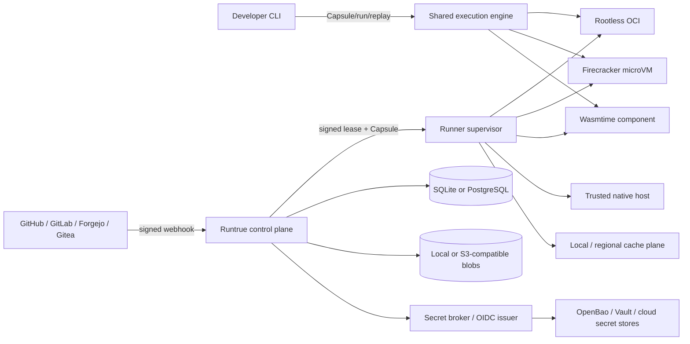
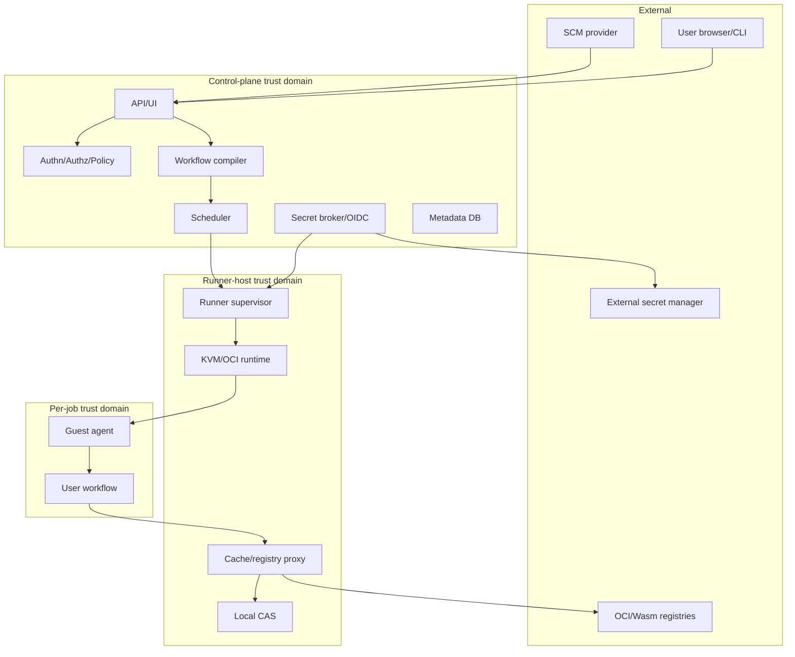
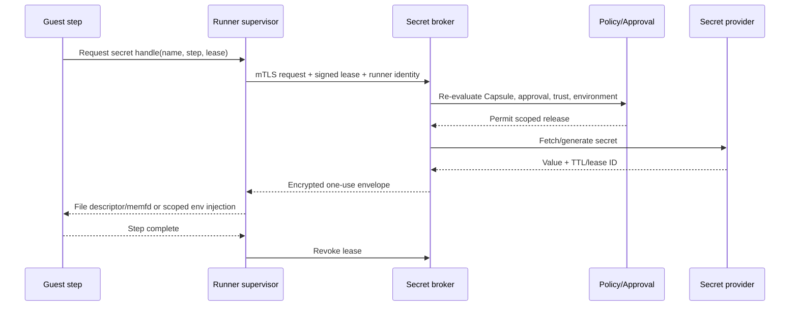
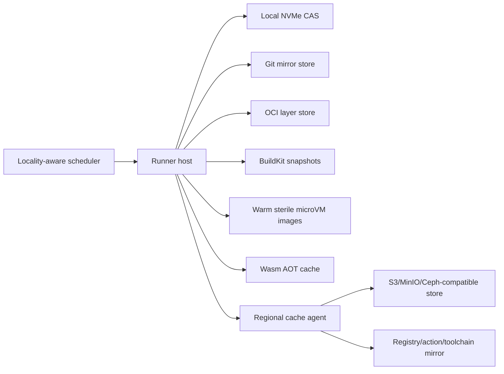

# Runtrue — Product and Technical Design

**Status:** Draft for implementation planning  
**Version:** 0.1  
**Date:** 2026-07-11  
**Public name:** Runtrue (`runtrue` CLI)
**Tagline:** Run local. Run remote. Run true.
**Primary implementation language:** Rust  
**Proposed license:** Apache-2.0 for the core platform, with a clear trademark policy and an optional contributor agreement only if later required.

The detailed contract Runtrue intends to make before declaring v1 is defined
in [Runtrue v1: long-term product and architecture](architecture/v1-long-term-design.md).
That document makes the generic execution control plane the long-term product
boundary and treats GitHub Actions as its first frontend and adoption path.

---

## 1. Executive summary

Runtrue is a lightweight, fully self-hosted CI/CD and automation platform built around one hard guarantee:

> Run local. Run remote. Run true.

The immutable execution artifact is a **Capsule**. An exact Capsule approval is a
**Seal**. **Bisim** is the shared-engine conformance suite, and a **Replay
Bundle** is the portable, secret-free input for reproducing an execution.

The product combines:

- Woodpecker-like operational simplicity.
- GitHub Actions-like workflow power and reusable components.
- Dagger-like local/remote consistency.
- Blacksmith-like data locality, warm state, fast microVM startup, and high-performance runner scheduling.
- A stronger trust, approval, secret, cache, and artifact model than mainstream hosted CI systems.

A minimal installation must require only:

```text
runtrue-server
runtrue-runner
SQLite
local filesystem storage
OCI runtime or Firecracker/KVM
```

PostgreSQL, S3-compatible storage, distributed cache agents, ClickHouse, Kubernetes, and external secret managers are optional scale-up integrations—not prerequisites.

The first release targets Linux on `amd64` and `arm64`. It supports:

- Rootless OCI jobs for trusted workloads.
- Firecracker microVMs for untrusted or multi-tenant workloads.
- WebAssembly Component actions for fast, capability-scoped reusable steps.
- Native Linux execution only for explicitly trusted repositories and runners.
- GitHub as the first source-control integration, while preserving a forge-neutral internal event model.
- Forgejo, Gitea, and GitLab adapters after the core GitHub path is stable.
- A native workflow format compiled to a deterministic Capsule.
- A GitHub Actions importer and compatibility report rather than making GitHub emulation the permanent architecture.

Security is based on immutable execution identities. Approval does not attach vaguely to “this PR” or “this YAML file.” An approval binds to a digest that includes the source commit, base commit, canonical workflow Capsule, resolved actions and images, capabilities, secret names, network policy, environment, runner isolation profile, and policy version. Any material change invalidates approval.

Acceleration is optional and trust-scoped. Local content-addressed storage,
repository mirrors, pre-unpacked OCI layers, persistent BuildKit caches,
copy-on-write disks, locality-aware scheduling, safe prefetching, Wasm AOT
compilation, and warm microVM pools may improve latency, but authorization and
cold-path correctness cannot depend on them. Cache failure must degrade to a
normal build rather than stalling or failing a workflow.

---

## 2. The product gap

Existing systems generally force teams to choose a subset of the following:

1. Lightweight operation.
2. Full self-hosting, including the control plane.
3. Powerful DAG, matrix, reusable workflow, environment, and deployment features.
4. Multi-forge integration.
5. Exact local/remote execution parity.
6. Strong isolation for hostile pull requests.
7. Fast cache and startup performance.
8. Fine-grained, reviewable permissions and secret use.

Runtrue exists to deliver all eight as one coherent system.

### 2.1 Primary user groups

- Teams that keep code on GitHub but do not want GitHub Actions pricing or control-plane dependency.
- Organizations that need sovereign, private, or air-gapped CI.
- Public open-source projects that need to test hostile fork pull requests safely.
- Companies with custom ARM, GPU, nested-virtualization, private-network, hardware-in-the-loop, or bare-metal workers.
- Developers who need exact reproduction of a failed CI run on a laptop or a private remote sandbox.
- Platform teams that want a small control plane rather than GitLab-scale operational overhead.
- Regulated organizations requiring explicit approval, audit, workload identity, data residency, and separation of duties.

### 2.2 Product statement

> An open automation platform that runs the same workflow locally and on your infrastructure, with secure-by-default approvals, secrets, isolation, caching, and artifact promotion.

### 2.3 Differentiators

1. **One execution engine:** local CLI and remote runner consume the same signed `ExecutionCapsule` format and shared Rust crates.
2. **Workflow trust gates:** target-branch workflow execution for untrusted changes, exact-hash approvals, and separate privileged-execution approval.
3. **Capability-scoped steps:** filesystem, network, secrets, OIDC, cache writes, artifacts, and runner features are explicit permissions.
4. **Performance without persistent compromise:** warm caches and disks are partitioned by trust domain and promoted only after validation.
5. **No mandatory heavy infrastructure:** SQLite and local blobs remain supported as a first-class production mode for small installations.
6. **Forge independence:** Git providers are adapters, not the execution model.
7. **Action portability:** OCI and Wasm components are native; common GitHub Actions can be imported with compatibility diagnostics.
8. **Reproducible replay:** a failed run produces a portable execution bundle without embedding secrets.

---

## 3. Design principles

### 3.1 Same Capsule, same engine

The server may trigger, authorize, schedule, and observe jobs, but it must not contain a second implementation of workflow execution. The local CLI and every remote runner use the same compiler, expression evaluator, graph planner, step lifecycle, cache protocol, and artifact protocol.

### 3.2 Secure defaults, explicit escalation

A workflow receives no write token, secret, unrestricted network, privileged device, host mount, trusted cache write, deployment permission, or signing operation unless the Capsule requests it and policy grants it.

### 3.3 Approval is content-addressed

Approval is granted to immutable facts, never to mutable labels such as a branch name, action tag, image tag, runner label, or “latest” environment.

### 3.4 The control plane is never a workload host

No repository code, action code, shell, plugin, build hook, templating extension, or user-defined policy executable runs inside the control-plane process.

### 3.5 Fast paths must fail safe

A cache, mirror, warm snapshot, registry proxy, or prefetch failure becomes a miss or cold start. It must not corrupt correctness, bypass verification, or hold a job indefinitely.

### 3.6 Scale-up features are optional

The architecture supports HA and large installations, but the minimum useful deployment does not require Kubernetes, Redis, Kafka, RabbitMQ, NATS, Elasticsearch, ClickHouse, PostgreSQL, or object storage.

### 3.7 Native primitives before compatibility hacks

The native engine and IR define correct behavior. GitHub Actions compatibility maps into that engine and reports mismatches. Compatibility code cannot weaken the native permission model.

### 3.8 Isolation is a policy decision

The scheduler chooses from Wasm, OCI, microVM, native host, or future backends according to trust and capabilities. A label alone cannot silently downgrade isolation.

### 3.9 Data locality is schedulable state

Git mirrors, OCI layers, toolchains, cache chunks, Wasm AOT code, and warm machine images are part of scheduler scoring—not accidental host state.

### 3.10 Auditability over magic

The UI and CLI must explain:

- Why a job was or was not allowed.
- Which approval was used.
- Which secret or identity was released.
- Which cache scope was read or written.
- Which immutable image/action digest executed.
- Why a runner was selected.
- Whether local replay is exact or approximate.

---

## 4. Scope

### 4.1 Version-one scope

- Linux `amd64` and `arm64`.
- GitHub App integration.
- Push, pull request, merge queue, tag, schedule, manual, and API triggers.
- Native workflow YAML.
- Deterministic workflow compiler and lock file.
- DAGs, matrices, conditions, services, retries, timeouts, concurrency groups, typed inputs/outputs, artifacts, caches, reusable workflows, and environments.
- Local execution and replay.
- Rootless OCI execution.
- Firecracker microVM execution on KVM-capable Linux hosts.
- Wasm Component actions through Wasmtime.
- Native Linux runner mode behind an explicit high-trust policy.
- Built-in encrypted secrets and non-secret variables.
- OpenBao/Vault provider interface and OIDC federation.
- Exact workflow-change approval and privileged-run approval.
- Network egress policies and DNS controls.
- SQLite and local filesystem defaults.
- PostgreSQL and S3-compatible storage options.
- High-speed local and distributed cache architecture.
- Artifact provenance and signature verification.
- Server-rendered web UI, REST API, runner gRPC API, CLI, and audit log.

### 4.2 Planned follow-on scope

- Forgejo, Gitea, and GitLab adapters.
- GitHub Actions importer for JavaScript, Docker, composite, and reusable workflows.
- Kubernetes executor and autoscaler.
- Windows native/VM agents.
- macOS Apple Silicon agents.
- GPU and hardware-device scheduling.
- Remote Execution API integration for Bazel/Pants-style workloads.
- Multi-region active/passive and later active/active scheduling.
- Optional hosted control plane without changing the self-hosted architecture.

### 4.3 Explicit non-goals for version one

- Perfect GitHub Actions behavioral compatibility.
- A built-in Git forge, issue tracker, package registry, or source-code search product.
- Running arbitrary untrusted JavaScript actions as if they were safe Wasm components.
- Mandatory Kubernetes.
- A plugin system that loads third-party native dynamic libraries into the server.
- Deterministic caching of arbitrary shell commands without declared inputs and outputs.
- Long-lived production signing keys exposed to runner memory.
- Cross-tenant cache deduplication by default.
- Firecracker GPU passthrough in the initial release.
- Billing, metering, or SaaS account management as core dependencies.

---

## 5. Success criteria and engineering targets

The following are design targets, not current product claims.

### 5.1 Lightweight targets

| Component | Target at idle | Notes |
|---|---:|---|
| `runtrue-server` | <150 MB RSS | SQLite, one installation, no external analytics |
| `runtrue-runner` daemon | <75 MB RSS | Excludes active jobs, BuildKit, Wasmtime code cache, and page cache |
| `runtrue` CLI | <50 MB RSS for planning | Execution runtime adds workload-specific memory |
| Small all-in-one install | Comfortable on 1 GB RAM | Build workloads require separate resource budgeting |
| Cold binary start | <300 ms on typical modern Linux | No network initialization on simple commands |

### 5.2 Control-plane service-level objectives

- Webhook acknowledgement p95 under 250 ms after durable event write.
- Capsule compilation p95 under 500 ms for ordinary workflows with lock data warm.
- Queue-to-lease p95 under 1 second when matching capacity exists.
- Control-plane availability target of 99.9% for a properly configured HA deployment.
- No loss of accepted webhook events after durable acknowledgement.
- At-least-once event processing with idempotent run creation.
- Runner lease recovery after missed heartbeats and fencing of stale workers.

### 5.3 Runner and performance targets

- OCI shell-ready p95 under 1 second when image layers are local.
- Firecracker guest shell-ready p95 under 3 seconds with a compatible warm base image.
- Warm repository checkout measured in seconds or less for ordinary deltas.
- Cache data path capable of saturating the configured runner NIC when storage permits.
- Degraded cache lookup fails open as a miss after a configurable short deadline.
- Local replay produces the same Capsule hash as the original remote run.
- Supported parity-grade-A runs produce identical declared artifact digests locally and remotely, assuming the same architecture and declared inputs.

### 5.4 Security acceptance criteria

- An untrusted pull request cannot execute its modified workflow before exact Capsule approval.
- An untrusted run cannot receive secrets, write credentials, deployment identity, trusted cache write access, or unrestricted egress by default.
- Any change to source commit, workflow, resolved action/image digest, permissions, secret set, environment, network policy, runner profile, or policy version invalidates approval.
- Secret material is released only to an approved step, not embedded in the Capsule or control-plane queue record.
- Each job receives an ephemeral workload identity with claims bound to its immutable Capsule and approval.
- Cache and artifact writes from untrusted jobs remain quarantined until explicit promotion or trusted rebuild.
- Every privileged decision is represented in an append-only, tamper-evident audit stream.
- Control-plane code runs unprivileged and never mounts the container socket or KVM device.

---

## 6. System context



### 6.1 Trust boundaries



The guest workload is always treated as potentially hostile. The runner supervisor is higher trust than a guest but is not trusted with installation-wide secrets or arbitrary control-plane database access. The control plane trusts runner claims only when backed by enrollment, short-lived mTLS identity, policy, and optional hardware attestation.

---

## 7. Rust-first implementation strategy

### 7.1 Decision

Use Rust for the control plane, runner, guest agent, CLI, workflow compiler, policy integration, cache agents, and core executors.

### 7.2 Why Rust fits this product

- A single language can cover web services, CLIs, daemons, KVM integration, OCI tooling, cryptography, networking, storage, and Wasm runtimes.
- Static binaries and explicit resource ownership support the lightweight deployment target.
- Rust integrates naturally with Firecracker/rust-vmm projects and Wasmtime.
- Memory safety reduces—but does not eliminate—the risk in security-critical parsers and network services.
- Cargo workspaces allow the local CLI and remote runner to share implementation crates rather than merely mimic behavior.
- Rust can compile selected internal utilities or SDK components to Wasm when useful.

### 7.3 Important trade-off

Rust will increase initial implementation cost in areas where mature Go libraries or operational examples are more common. The response is not to mix in a second primary language; it is to isolate external-system integrations behind stable traits and protocol boundaries, keep dependencies conservative, and avoid writing custom cryptography or virtualization components when maintained libraries exist.

### 7.4 Proposed core stack

| Concern | Proposed technology | Notes |
|---|---|---|
| Async runtime | Tokio | Pin versions and test cancellation behavior |
| HTTP server | Axum + Tower | Small, composable middleware stack |
| Public API | REST/JSON | Stable and easy for users/tools |
| Runner protocol | Tonic/Prost gRPC | Streaming, mTLS, versioned protobuf |
| CLI | Clap | Static commands, machine-readable JSON output |
| Serialization | Serde | Strict schemas, deny unknown security fields where appropriate |
| SQLite | `sqlx` or `rusqlite` | Decide after migration/profiling spike |
| PostgreSQL | `sqlx` | Shared query layer where practical |
| Policy | Cedar Rust crates | Embedded authz and policy validation |
| WebAssembly | Wasmtime Component Model | Capability adapter controlled by Runtrue |
| OCI | Backend abstraction over rootless runtime | Start with `runc`/`crun`; evaluate `youki` as optional Rust backend |
| MicroVM | Firecracker + jailer | Host supervisor, guest agent over vsock |
| Crypto | RustCrypto plus audited platform/KMS clients | No home-grown primitives |
| TLS | rustls | mTLS runner connections and HTTPS support |
| IDs | UUIDv7 or ULID | Time-sortable, globally unique |
| Logs/metrics | OpenTelemetry protocol | Local simple store by default, external export optional |
| UI | Server-rendered HTML + minimal TypeScript/JS | No Node runtime required in production |

### 7.5 Dependency policy

- Pin direct dependencies in `Cargo.lock` for released binaries.
- Use `cargo-deny`, `cargo-audit`, and `cargo-vet` or an equivalent review process.
- Minimize `unsafe`; every unsafe block requires a safety comment and code-owner review.
- Run Miri on suitable core crates and fuzz parsers/protocol codecs continuously.
- Require signed releases, SBOMs, provenance attestations, and reproducible build investigations.
- Support only the current and previous runner protocol generation during rolling upgrades.

### 7.6 WebAssembly version policy

WASI 0.3.0 was released on June 11, 2026 and adds native async to the Component Model. ADR 0006 selects it as the unreleased v0.x runtime baseline with Wasmtime 46.0.1 and no WASI 0.2 compatibility mode. Therefore:

1. Standard WASI imports target the pinned final 0.3.0 interface set.
2. Runtrue-owned WIT package names retain explicit semantic versions independently from WASI.
3. A fresh default-deny WASI context exposes no inherited environment, files, standard streams, or network.
4. The exact WASI version participates in signed compatibility metadata and authenticated AOT cache identity.
5. No workflow Capsule depends directly on runtime-specific host functions; it depends on Runtrue capability interfaces.
6. An asynchronous Runtrue action export and broad guest SDK claims require separate conformance evidence for futures, streams, cancellation, and backpressure.

Wasm is the preferred runtime for compact reusable actions, policy-safe transformations, metadata processing, artifact handling, and tools that fit a capability model. It is not the only job runtime and does not replace containers or microVMs for arbitrary build tools.

---
## 8. Component architecture

### 8.1 Binaries

#### `runtrue-server`

An unprivileged control-plane service containing:

- HTTP API and server-rendered UI.
- Authentication and authorization.
- SCM adapters and webhook verification.
- Event normalization.
- Workflow discovery, compilation, locking, and risk analysis.
- Approval service.
- Scheduler and runner registry.
- Secret metadata service, secret broker, and OIDC issuer.
- Cache/artifact metadata service.
- Run, log, environment, deployment, notification, and audit services.

It does **not** execute user code and must not require `/var/run/docker.sock`, `/dev/kvm`, privileged containers, or host root.

#### `runtrue-runner`

A host-level supervisor responsible for:

- Enrollment and short-lived mTLS identity.
- Capability inventory and host health.
- Pull-based lease acquisition.
- Signed Capsule verification.
- Workspace and disk preparation.
- OCI, Firecracker, Wasm, and trusted-native executor orchestration.
- Guest-agent communication.
- Network policy enforcement.
- Local CAS, image, Git, and BuildKit cache integration.
- Log streaming, artifact upload, secret lease forwarding, cancellation, and cleanup.

The runner should run as a dedicated system user. KVM and OCI privileges are separated into narrowly scoped helpers where practical.

#### `runtrue-guest`

A minimal static guest agent included in microVM images. It:

- Receives an authenticated, one-job Capsule over vsock.
- Creates step processes and captures structured output.
- Requests scoped secrets and OIDC tokens through the host proxy.
- Mounts declared inputs, caches, and artifact paths.
- Enforces step lifecycle and cancellation.
- Reports resource usage and exit status.
- Zeroizes and unmounts ephemeral secret material.

It does not possess a reusable control-plane credential.

#### `runtrue`

The developer and administrator CLI:

```text
runtrue init
runtrue validate
runtrue capsule [job]
runtrue run [job]
runtrue run [job] --remote
runtrue replay <run-id> --local
runtrue seal approve <approval-request>
runtrue secrets set|get|delete|rotate
runtrue vars set|get|delete
runtrue runners list|drain
runtrue cache inspect|prune
runtrue doctor
```

All commands support machine-readable JSON output and stable exit codes.

#### `runtrue-image`

A hardened image build and verification tool for:

- Firecracker kernels/root filesystems.
- OCI base images.
- Preinstalled toolchain layers.
- Wasm AOT caches.
- Image manifests, SBOMs, signatures, and TUF metadata.
- Operator-side staging of digest-pinned Wasm components from private OCI
  registries. Registry credentials remain outside Capsules and runners; only
  exact, verified component bytes enter the runner preload store.

### 8.2 Optional services

These are disabled in the minimal deployment:

- `runtrue-cache-agent`: rack/region cache and registry proxy.
- `runtrue-autoscaler`: provisions and drains runner hosts.
- `runtrue-analytics`: ClickHouse-oriented high-volume event ingest/query service.
- `runtrue-log-shipper`: external OpenTelemetry or object-log export.
- `runtrue-mirror`: air-gapped action, image, and toolchain mirror.

### 8.3 Library boundaries

The Rust workspace should keep domain logic out of binaries:

```text
crates/
  model/                 Canonical domain types and IDs
  workflow-ast/          Strict parsed workflow syntax
  workflow-ir/           Deterministic canonical execution IR
  expression/            Typed expression parser/evaluator
  compiler/              AST -> resolved/locked IR
  engine/                Shared job/step lifecycle state machine
  protocol/              Runner protobuf and version negotiation
  scheduler/             Matching, fairness, locality, leases
  policy/                Risk model and policy evaluation
  authz/                 Cedar integration and resource mapping
  scm/                   Provider-neutral traits and event model
  scm-github/            GitHub App implementation
  secrets/               Envelope encryption, leases, provider traits
  identity/              OIDC issuer and workload claims
  cache/                  CAS, cache keys, trust scopes, promotion
  artifacts/             Immutable artifacts and provenance
  storage/               DB/blob traits and implementations
  audit/                 Tamper-evident audit events
  executor-wasm/          Wasmtime host and WIT capabilities
  executor-oci/           Rootless OCI execution
  executor-firecracker/   MicroVM lifecycle, jailer, snapshots, vsock
  executor-native/        Explicitly trusted host execution
  runner-core/            Host-neutral runner state machine
  guest-core/             Guest-agent protocol and step execution
  attest/                 Signatures, SBOMs, SLSA/in-toto statements
```

No control-plane crate may depend on executor crates. The dependency direction is enforced in CI.

---

## 9. Workflow model

### 9.1 File locations

Native workflows default to:

```text
.runtrue/workflows/*.yaml
.runtrue/components/*
.runtrue/policies/*
.runtrue.lock
```

A repository may configure another root, but discovery is controlled by trusted repository settings rather than an untrusted event payload.

### 9.2 Native workflow example

```yaml
version: 1
name: test-and-package

on:
  push:
    branches: [main]
  pull_request: {}
  manual:
    inputs:
      full_suite:
        type: boolean
        default: false

permissions:
  repository: read
  checks: write
  network: deny
  oidc: deny
  cache:
    read: verified
    write: quarantine

vars:
  RUST_BACKTRACE: "1"

jobs:
  test:
    runner:
      os: linux
      arch: amd64
      isolation: microvm
      cpu: 4
      memory: 8GiB

    trust: untrusted-ok
    timeout: 20m

    services:
      postgres:
        image: docker.io/library/postgres@sha256:0123456789abcdef
        ports: [5432]
        env:
          POSTGRES_PASSWORD:
            literal: test-only
        healthcheck:
          command: ["pg_isready", "-U", "postgres"]
          interval: 1s
          timeout: 2s
          retries: 30

    steps:
      - id: checkout
        uses: runtrue://builtin/checkout@sha256:1111111111111111
        with:
          fetch-depth: 20

      - id: toolchain
        uses: wasm://registry.example/runtrue/setup-rust@sha256:2222222222222222
        capabilities:
          fs:
            write: ["$RUNTRUE_TOOLS/rust"]
          network:
            allow:
              - host: static.rust-lang.org
                port: 443

      - id: test
        run:
          shell: bash
          script: |
            set -euo pipefail
            cargo test --locked --all-targets
        env:
          PR_TITLE:
            from: event.pull_request.title
        cache:
          inputs:
            - Cargo.lock
            - rust-toolchain.toml
            - src/**
          outputs:
            - target/**
          mode: read-write

      - id: report
        uses: wasm://registry.example/runtrue/junit-report@sha256:3333333333333333
        with:
          path: target/junit.xml
        capabilities:
          fs:
            read: ["target/junit.xml"]
          checks: write

    outputs:
      test-binary:
        path: target/debug/my-app
        retention: 7d
        classification: untrusted-build

  publish:
    needs: [test]
    if: event.ref == "refs/heads/main"
    environment: production
    trust: trusted-only
    permissions:
      repository: read
      artifacts: read
      registry: write
      oidc:
        audiences: ["registry.example"]
      network:
        allow:
          - host: registry.example
            port: 443
    steps:
      - uses: runtrue://builtin/verify-artifact@sha256:4444444444444444
        with:
          artifact: ${{ needs.test.outputs.test-binary }}
          require-provenance: true
      - run:
          command: ["./scripts/publish", "--artifact", "$RUNTRUE_INPUT_ARTIFACT"]
```

### 9.3 Safer expression design

GitHub-style string interpolation into shell scripts is a frequent injection hazard when values come from pull-request titles, branch names, issue text, or other untrusted contexts. Runtrue therefore separates expressions from script source:

- Expressions produce typed values.
- Untrusted values are passed as environment variables, files, standard input, or argument-vector elements.
- A `run.script` is static after Capsule compilation.
- A `run.command` is an explicit argument vector and is preferred over shell strings.
- Direct interpolation into `run.script` is denied by default and requires an explicit unsafe policy exception.
- Secret expressions cannot be rendered into Capsule diagnostics or reusable workflow outputs unless specifically permitted.

Example:

```yaml
- run:
    command: ["python", "scripts/check_title.py", "--title"]
    args:
      - from: event.pull_request.title
```

The value becomes one argument regardless of shell characters.

### 9.4 Core workflow features

The native language supports:

- Arbitrary acyclic job graphs through `needs`.
- Static and bounded dynamic matrices.
- Typed workflow, reusable-workflow, manual, and component inputs.
- Typed job and step outputs.
- Conditions over typed contexts.
- Service containers and health checks.
- Timeouts, retries, backoff, cancellation propagation, and `finally` steps.
- Concurrency groups and superseding prior runs.
- Artifacts, reports, caches, test annotations, and summaries.
- Protected environments and deployment approvals.
- Scheduled, webhook, manual, API, repository-dispatch, and dependent-workflow triggers.
- Reusable workflows pinned by digest.
- Cross-repository workflows only through explicitly trusted, immutable references.
- Child workflows and bounded fan-out.
- Manual gates that do not occupy a runner.
- Long-running jobs with lease renewal and explicit resumability declarations.

### 9.5 Capability model

Every step receives a capability set. Representative capabilities:

```text
fs.workspace.read
fs.workspace.write
fs.tools.read
fs.tools.write
network.connect(host, port, protocol)
network.listen(port)
secret.read(scope, name)
var.read(scope, name)
oidc.mint(audience)
cache.read(namespace)
cache.write(namespace)
artifact.read(id)
artifact.write(classification)
checks.write
repository.status.write
repository.contents.write
deployment.request(environment)
signing.request(key-purpose)
device.use(name)
kvm.use
privileged.container
host.mount(path)
```

Capabilities are accumulated from:

1. Installation maximums.
2. Tenant and repository policy.
3. Workflow request.
4. Job/step request.
5. Trust classification.
6. Approval grant.
7. Runner capability and attestation.

The final set is the intersection, never the union, of allowed scopes.

### 9.6 Workflow lock file

`.runtrue.lock` records immutable resolutions:

```toml
lock_version = 1

[[component]]
source = "wasm://registry.example/runtrue/setup-rust@v2"
resolved = "sha256:..."
signature_identity = "release@runtrue.example"
wit_world = "runtrue:action/run@1.0.0"

[[image]]
source = "docker.io/library/postgres:17"
resolved = "docker.io/library/postgres@sha256:..."
platform = "linux/amd64"

[[workflow]]
source = "git+https://example/reusable.git//build.yaml@v3"
commit = "9f5b..."
digest = "sha256:..."
```

OCI jobs declare the logical job image beside their isolation requirement; it
is not inferred from runner inventory or an executor default:

```yaml
jobs:
  test:
    runner:
      os: linux
      arch: amd64
      isolation: oci
      image: registry.example/runtrue/build-tools:2026.07
    steps:
      - run: { command: ["cargo", "test", "--workspace"] }
```

Compilation requires an exact matching `[[image]]` lock entry for
`linux/amd64`, replaces the logical reference with its digest-only resolution
in the Capsule, and includes that digest in the approval subject. Non-OCI jobs
must not declare `runner.image`.

Policies can:

- Reject mutable references.
- Permit lock regeneration only in a designated dependency-update workflow.
- Require signatures or approved publisher identities.
- Restrict registries and Git origins.
- Require review when a resolved digest changes even if the human-readable version does not.

### 9.7 Canonical Capsule

The compiler emits an `ExecutionCapsule` with:

- Schema and engine compatibility versions.
- Source and base commit IDs.
- Normalized event digest.
- Canonical workflow digest.
- Fully expanded DAG and matrix.
- Static script hashes and argument templates.
- Resolved OCI, Wasm, and reusable-workflow digests.
- Step capabilities and trust labels.
- Secret and variable references by metadata ID, never values.
- Network policy.
- Runner requirements and isolation floor.
- Cache and artifact scopes.
- Environment and deployment constraints.
- Policy version and approval requirements.
- Replay metadata and parity expectation.

Canonicalization requirements:

- Deterministic field ordering.
- No locale-sensitive transformations.
- Explicit defaults serialized into the Capsule.
- Normalized duration, path, and size representations.
- Protobuf canonical digest representation or canonical CBOR for signing.
- Unknown security-sensitive fields cause compilation failure.
- The Capsule hash is stable across server and CLI implementations built from the same supported compiler generation.

### 9.8 Compilation stages

```text
Discover trusted workflow source
  -> parse strict YAML
  -> schema validation
  -> expression type checking
  -> reusable workflow expansion
  -> matrix expansion / dynamic-bound analysis
  -> action and image resolution
  -> permission/capability calculation
  -> trust classification
  -> policy evaluation
  -> risk report
  -> canonical ExecutionCapsule
  -> Capsule signature
```

Planning must not execute repository code. Dynamic planning inputs are limited to signed metadata, trusted API results explicitly admitted by policy, or outputs of isolated planning components with no secret access.

---

## 10. Local and remote parity

### 10.1 Guarantee

`runtrue run`, `runtrue run --remote`, and a server-triggered run consume the same `ExecutionCapsule` and execute through the same `engine` crate. The only expected differences are declared providers:

- Local versus remote secret source.
- Local versus remote cache endpoint.
- Local versus remote artifact endpoint.
- Available hardware/isolation backend.
- Host architecture when the workflow permits multiple platforms.

### 10.2 Commands

```bash
# Validate syntax, lock state, policy, and permissions.
runtrue validate

# Produce the exact Capsule and risk report without executing.
runtrue capsule test --event .runtrue/events/pull-request.json

# Execute locally.
runtrue run test --event .runtrue/events/pull-request.json

# Submit the exact Capsule to remote infrastructure.
runtrue run test --remote --event .runtrue/events/pull-request.json

# Reproduce a prior run.
runtrue replay 01JABCDEF123 --local

# Verify that local and remote Capsule hashes match.
runtrue compare-capsule 01JABCDEF123
```

### 10.3 Replay bundle

A Replay Bundle is an immutable manifest containing:

- Run, job, and Capsule IDs.
- Source and base commit IDs.
- Canonical event fixture or redacted event projection.
- Workflow and lock digests.
- Resolved image and action digests.
- Runner image/kernel/rootfs identifiers.
- Architecture and resource profile.
- Public variables and environment metadata.
- Input artifact digests.
- Cache key references and optional snapshot identifiers.
- Policy and approval IDs.
- Engine and protocol versions.

It never contains:

- Secret values.
- Long-lived access tokens.
- Raw KMS/HSM key material.
- Reusable runner credentials.
- Private event fields not required for replay.

Local replay obtains secrets from a local provider, prompts for them, or runs in a redacted mode. The CLI shows which unavailable secret-dependent steps cannot be reproduced.

### 10.4 Parity grades

| Grade | Meaning | Typical backend |
|---|---|---|
| A — exact | Same Capsule, architecture, immutable images/components, declared inputs, and runtime semantics | Wasm or OCI on matching Linux host |
| B — environment-equivalent | Same Capsule and guest image, but local host cannot reproduce the exact hypervisor/storage topology | Firecracker remote, container/VM local |
| C — platform-specific | Same Capsule semantics but platform toolchain or hardware differs | macOS/Windows/device jobs |
| D — non-replayable | External irreversible side effect or missing protected input | Production deployment/signing operation |

The UI must never describe grade B–D as “identical.”

### 10.5 Conformance suite

Every supported engine release runs a corpus locally and remotely, comparing:

- Capsule digest.
- Job/step state transitions.
- Exit status and retry behavior.
- Structured log events after normalizing timestamps.
- Declared output values.
- Artifact digests.
- Cache hit/miss decisions.
- Network and permission denials.
- Secret release audit events.
- Cancellation and timeout semantics.

A runner cannot advertise a new engine version as generally available until it passes the signed conformance suite.

---
## 11. Trust, approval, and workflow-change security

This is the defining security feature of Runtrue.

### 11.1 Problem statement

A workflow file is executable infrastructure policy. A change can:

- Exfiltrate secrets.
- Replace a pinned action with a mutable or malicious reference.
- Add network access.
- Request a more privileged runner.
- Poison caches or artifacts.
- Change OIDC audiences or deployment destinations.
- Mount host devices or sockets.
- Execute pull-request-controlled data in a trusted context.

Approving a pull request or clicking “run workflow” is not sufficient unless the approval is bound to the exact executable Capsule and privileges.

### 11.2 Two independent gates

#### Gate A: workflow-definition approval

Approves the exact workflow and dependency resolution that may execute.

It answers:

> Has an authorized reviewer accepted this workflow definition, its resolved dependencies, and its requested capabilities?

#### Gate B: privileged-execution approval

Approves a specific invocation with privileged inputs or targets.

It answers:

> May this exact source commit and Capsule receive these secrets, identities, network permissions, runner capabilities, or deployment access now?

A repository may require Gate A for workflow changes and Gate B only for production or other sensitive runs. Highly regulated installations may require both for every privileged execution.

### 11.3 Safe pull-request default

For an untrusted pull request:

1. Fetch the trusted workflow from the target/base branch.
2. Compile that workflow with the pull request source commit as the code-under-test.
3. Run it in a microVM with read-only repository identity, no secrets, restricted egress, and quarantine-only writes.
4. Parse and risk-analyze any proposed workflow changes, but do not execute them.
5. Present the workflow diff and risk report to designated approvers.
6. If approved, compile a new Capsule bound to the exact pull-request commit and resolved dependencies.
7. Recheck policy immediately before lease and secret release.

This avoids relying on contributor-history heuristics. A previously merged typo does not grant ongoing trust.

### 11.4 Approval binding

An `ApprovalSubject` digest includes at minimum:

```text
installation_id
tenant_id
repository_id
source_commit
base_commit
normalized_event_digest
canonical_workflow_digest
execution_capsule_digest
lockfile_digest
resolved_action_digests[]
resolved_image_digests[]
reusable_workflow_digests[]
permission_set
secret_metadata_ids[]
variable_snapshot_digest
network_policy_digest
cache_policy_digest
artifact_policy_digest
runner_profile
isolation_floor
environment_id
deployment_target_digest
policy_version_ids[]
engine_compatibility_version
expiration_boundary
```

Any material difference produces a new subject and invalidates prior approval.

### 11.5 Approval rules

Configurable rules include:

- One or more code owners for workflow paths.
- Separate security-team approval for new secrets, signing, host access, privileged containers, or broad egress.
- Environment owners for deployment targets.
- N-of-M approval thresholds.
- Author cannot approve their own change.
- Last-pusher cannot be sole approver.
- Secret custodian cannot be the only workflow approver.
- Step-up authentication with recent MFA/SSO assertion.
- Approval expiry.
- Approval limited to one execution or a bounded commit range.
- Dismissal after any subject change.
- Emergency break-glass with reason, short TTL, dual notification, and enhanced audit.
- No API token may approve unless explicitly assigned an approval-capable service identity.

### 11.6 Risk report

The compiler emits human- and machine-readable risk findings. Examples:

```text
HIGH   Adds secret: prod-registry-token to job publish
HIGH   Changes isolation from microvm to native
HIGH   Adds network wildcard *.example.com:443
HIGH   Introduces privileged.container capability
HIGH   Changes OIDC audience between deployments
HIGH   Adds write access to repository contents
MEDIUM Replaces action digest sha256:A with sha256:B
MEDIUM Increases cache write scope from branch to repository
MEDIUM Enables artifact promotion from untrusted job
MEDIUM Adds host device /dev/kvm
LOW    Adds read-only variable CI_VERBOSE
INFO   Changes test timeout from 10m to 20m
```

Risk is calculated from semantic Capsule differences, not text lines alone.

### 11.7 Approval modes

Repositories choose from these policy templates:

#### Strict

No changed workflow executes until exact Capsule approval. Required for public untrusted repositories and high-sensitivity environments.

#### Trusted-base

Untrusted changes run only with target-branch workflows. Changed workflows require approval before any execution.

#### Trusted-maintainers

Members of designated teams can execute changed non-privileged workflows automatically; privileged capability changes still require approval.

#### Policy auto-approval

A deterministic policy may auto-approve changes that remain within a low-risk envelope, such as:

- No secret or OIDC access.
- No write token.
- No deployment.
- No host/privileged capability.
- Denied or allowlisted network only.
- Quarantine cache/artifact writes only.
- Approved action/image registries and immutable digests.

The system records the policy decision as an approval actor with the exact policy version.

### 11.8 Build/publish separation

A recommended secure release workflow is:

1. Untrusted or ordinary build job compiles and tests without release credentials.
2. Outputs are immutable, quarantined artifacts with provenance.
3. A separate trusted promotion job verifies source, builder identity, Capsule digest, tests, signatures, SBOM, and policy.
4. Promotion copies or re-signs the artifact without executing it.
5. Production credentials are available only to the promotion step.

No release job should execute an artifact supplied by an untrusted build before verification.

### 11.9 Workflow ownership

Runtrue supports a `WORKFLOWOWNERS` file with stricter semantics than ordinary code ownership:

```text
/.runtrue/workflows/**       @platform-security @release-engineering
/.runtrue/policies/**        @security-governance
/.runtrue/components/**      @platform-security
/.runtrue.lock               @dependency-trust
```

Policy may require multiple independent owner groups rather than one matching owner.

### 11.10 Race prevention

Approval and dispatch use optimistic concurrency and immutable commits:

- The server refetches and verifies source/base commit existence before dispatch.
- The Capsule signature includes the commit and dependency digests.
- The runner verifies the Capsule signature and lease subject.
- The secret broker verifies current approval and lease generation at release time.
- Force-pushing a branch does not mutate an existing run; it creates a new event and Capsule.
- A stale runner cannot complete or publish after its fencing generation is superseded.

---

## 12. Security architecture

### 12.1 Threat actors

- Malicious public-fork contributor.
- Compromised contributor or maintainer account.
- Malicious or compromised reusable action.
- Compromised package, image, toolchain, or registry.
- Hostile tenant sharing an installation.
- Compromised runner guest.
- Compromised runner host or runner administrator.
- Control-plane attacker.
- Storage or network attacker.
- Insider with legitimate but excessive permissions.
- Malicious or coerced approver.

### 12.2 Protected assets

- Source code and private repository data.
- Static and dynamic secrets.
- Workload identities and cloud roles.
- Signing keys and signing authority.
- Runner hosts and private networks.
- Caches, artifacts, test results, and release outputs.
- Workflow, policy, and approval integrity.
- Audit records.
- Tenant metadata and billing/usage data if added later.

### 12.3 Core controls

#### Isolation

- Firecracker microVMs for hostile workloads.
- Rootless OCI with user namespaces for trusted low-risk workloads.
- Wasmtime capability sandbox for component actions.
- Native execution only on dedicated trusted runner pools.
- No shared writable container daemon between jobs.
- Per-job network namespace and firewall policy.
- Per-job ephemeral workspace.

#### Identity

- Short-lived mTLS runner certificates.
- Signed leases and Capsules.
- Per-job workload identity.
- Per-step secret leases.
- OIDC with tightly bound claims and audience allowlists.
- No long-lived cloud credential by default.

#### Supply chain

- Immutable action/image/reusable-workflow digests.
- Publisher allowlists and signature verification.
- TUF-style update metadata for Runtrue binaries and trusted catalogs.
- SBOM and provenance attestations.
- Policy-driven dependency resolution.

#### Authorization

- Default deny.
- Step-level capabilities.
- Cedar-backed RBAC/ABAC.
- Separation of duties.
- Exact Capsule approval.
- Environment and deployment gates.

#### Data

- Envelope encryption for built-in secrets.
- Tenant-scoped encryption context.
- Immutable artifact IDs.
- Trust-scoped cache namespaces.
- Audit log hash chaining and external export.

#### Operations

- Minimal control-plane privileges.
- Hardened runner images.
- Signed updates and rollback protection.
- Host patch and kernel/microcode policy.
- Security conformance and escape testing.
- Drain/cordon/revoke controls for runners.

### 12.4 Isolation policy matrix

| Workload | Default isolation | Secrets | Network | Cache writes |
|---|---|---|---|---|
| Public fork PR | Firecracker | None | Deny/strict allowlist | Quarantine only |
| Internal PR, changed workflow | Firecracker until approved | None before approval | Strict allowlist | Quarantine |
| Trusted branch test | Rootless OCI or Firecracker | Step-scoped | Workflow allowlist | Verified namespace |
| Production deployment | Firecracker or dedicated native | Dynamic/OIDC only where possible | Environment allowlist | Usually read-only |
| Wasm metadata action | Wasmtime | Explicit handle only | Explicit host capability | Declared only |
| Hardware/device test | Dedicated native pool | Minimal | Pool policy | Repository scope |

### 12.5 Network security

Each job has a declarative network policy:

```yaml
permissions:
  network:
    dns: restricted
    allow:
      - host: crates.io
        port: 443
        protocol: tcp
      - host: static.crates.io
        port: 443
        protocol: tcp
    deny-private-ranges: true
    listen: []
```

Implementation requirements:

- Network namespace per job.
- Egress enforced outside the guest where possible.
- DNS proxy resolves only allowed names and pins resolved addresses for a bounded period.
- Defend against DNS rebinding and CNAME escapes.
- Default deny metadata services, host bridge addresses, control-plane addresses, storage networks, and other tenants.
- SNI/HTTP proxy enforcement can be optional; IP/CIDR policy remains authoritative.
- Service containers live on a private per-job network.
- Network logs contain destination metadata but never payloads by default.
- A policy can require an approved egress proxy for artifact downloads.
- Air-gapped mode denies all external egress and uses mirrors.

### 12.6 Filesystem and host security

- Workspace paths are normalized and symlink-safe.
- Artifact and cache extraction rejects path traversal, device nodes, unsafe ownership, and oversized entries.
- Mount propagation is private.
- Host paths are unavailable unless explicitly approved and tied to a dedicated runner pool.
- Docker socket, containerd socket, KVM device, BPF, perf events, host PID namespace, and host network are capabilities—not defaults.
- Secret files use memory-backed mounts or sealed file descriptors where supported.
- Core dumps are disabled for secret-bearing processes unless explicitly permitted in a debug profile that revokes secrets first.

### 12.7 MicroVM security

Firecracker is the primary high-isolation backend on Linux/KVM.

Requirements:

- Use the Firecracker jailer or equivalent host sandbox.
- One microVM per job by default.
- Separate guest kernel from host kernel.
- Minimal device model.
- Guest communication through vsock, not an exposed management port.
- Copy-on-write root disks; destroy writable layers after job.
- Authenticate, encrypt, version, and sign snapshots because snapshot files are trusted state.
- Never snapshot a running job after secrets have been released.
- Warm snapshots are created only from sterile base images before job identity, source, or secrets are injected.
- Rotate and patch host kernel, guest kernel, microcode, Firecracker, and jailer.
- Enforce CPU, memory, I/O, network, and process limits.
- Dedicated host pools for nested virtualization or other elevated features.
- Collect guest crash reason without exposing unrelated host data.

### 12.8 OCI security

- Rootless user namespaces by default.
- Read-only root filesystem where workflow permits.
- Seccomp, AppArmor/SELinux, capability drop, and no-new-privileges.
- No privileged mode unless an exact Capsule approval grants it on a dedicated pool.
- Job and service image digests and signatures verified before execution.
- The locked job image, canonical Capsule `runner.image`, signed remote assignment,
  executor configuration, and per-step runner requirement must match exactly.
- Untrusted image layers unpacked in a controlled snapshotter.
- Per-job container runtime state.
- OCI runtime is an interchangeable backend; `runc`/`crun` are initial supported paths, with `youki` evaluated as an optional Rust-native path after conformance and hardening.

### 12.9 Wasm security

Runtrue actions are WebAssembly Components with WIT-defined imports.

Default imports provide no filesystem, network, environment, clock precision, randomness, secret, process, or host access beyond the declared component world. Capabilities are passed as unforgeable host resources.

Remote Wasm runners are configured from preloaded component bytes, signed
component manifests, trusted component-verification keys, an authenticated AOT
cache, and private runtime key material. The signed manifest name binds the
complete immutable `wasm://` or `oci://` component reference. A runner advertises
the backend only after every configured component passes signature, digest,
WIT, Wasmtime, target, and cold/AOT compilation probes. Lease admission then
requires every Component reference in the canonical signed Capsule to have an
exact local assignment; there is no network fetch, mutable selector, or
cross-backend fallback.

Registry authentication belongs to provisioning. A pinned `runtrue-image`
invocation uses a digest-pinned ORAS client and, when authentication is needed,
an owner-only, registry-scoped Docker credential file to fetch an exact
manifest and its exact Wasm blob. It admits only the Runtrue component artifact
type with one `application/wasm` layer, verifies both digests and the declared
byte length, and atomically creates a digest-named private payload. Credentials
are not included in the Capsule, runner configuration, workflow environment,
logs, or staged payload. This supports GHCR and other OCI Distribution
registries without weakening the runner's no-network execution boundary.

Controls:

- Fuel/epoch interruption and wall-clock timeouts.
- Memory/table limits.
- No inherited environment.
- Virtual filesystem handles for declared paths only.
- Host-mediated HTTP/network client rather than ambient sockets by default.
- Structured secret handles; raw secret bytes only when the component truly requires them.
- AOT cache keyed by Wasmtime version, target, component digest, and CPU feature floor.
- Signed component manifests and WIT version checks.
- Fuzz host adapters and reject resource leaks.

### 12.10 Native runner security

Native execution is required for some macOS, Windows, device, and specialist workloads but is the least isolated mode.

- Native pools are opt-in and labeled high trust.
- Public fork jobs cannot target native pools.
- Runner capability labels are attested by the server, not accepted solely from workflow text.
- Prefer disposable VMs or host reimaging.
- Restrict secrets to dynamic, short-lived credentials.
- Verify cleanup and rotate runner identity after each privileged run.
- Warn prominently that native jobs can potentially persist below the runner process boundary.

### 12.11 Debug sessions

Interactive debugging is valuable but dangerous.

- Disabled by default for production environments and public untrusted jobs.
- Requires a separate approval and recent MFA.
- Revoke or withhold secrets before opening a session unless explicitly approved.
- Issue an ephemeral client certificate and one-use tunnel token.
- No inbound public runner port; tunnel through an authenticated relay or reverse connection.
- Record session metadata and optionally terminal transcripts according to policy and privacy requirements.
- Hard timeout and immediate revocation.
- Debugged runs cannot directly promote artifacts without a fresh trusted rebuild or policy exception.

### 12.12 Residual risks

No architecture removes all risk. Documented residual risks include:

- Host kernel, KVM, Firecracker, container runtime, or CPU vulnerabilities.
- A trusted action or toolchain publisher becoming compromised.
- A workflow intentionally exfiltrating a secret through an allowed destination.
- A malicious authorized approver.
- A compromised local developer machine during replay.
- Native runner persistence.
- Side channels across shared hardware.
- Incorrect policy configuration.
- External cloud or registry compromise.

The UI must make these residual risks visible in runner and policy profiles rather than imply absolute isolation.

---

### 12.13 Security improvements relative to GitHub Actions

This comparison is intentionally precise: several items below can be approximated in GitHub with careful repository settings, environments, external tooling, or custom runners. Runtrue makes them native, enforceable contracts rather than relying primarily on workflow-author discipline.

| Area | Common GitHub Actions model | Runtrue design |
|---|---|---|
| Workflow-change approval | A maintainer approves a run/PR under repository settings | Approval binds the exact source/base commits, compiled Capsule, dependencies, permissions, secrets, network, runner, environment, and policy versions |
| Untrusted workflow changes | Fork approval and event behavior must be configured carefully | Target-branch workflow runs by default; changed workflow is analyzed but not executed before approval |
| Contributor trust | Settings may distinguish first-time or external contributors | No implicit trust from contribution history; trust is identity/policy/Capsule based |
| Privileged execution | Environment approval gates a job/environment | Separate workflow-definition and privileged-execution approvals, both exact-subject bound |
| Action references | Full-SHA pinning can be recommended or restricted | Mutable references are rejected by policy and lock resolution is part of approval |
| Action sandbox | JavaScript/Docker actions receive the job environment/runtime permissions | Wasm Components can receive narrowly scoped filesystem, network, secret, cache, artifact, and API capabilities |
| Secrets | Repository/org/environment secrets are referenced by workflow | Secret values are issued through per-step, purpose-bound, short-lived leases and are absent from the Capsule/queue |
| Cloud identity | OIDC is available | OIDC claims additionally bind Capsule digest, approval, runner posture, trust level, and environment; audience allowlists are mandatory |
| Signing keys | Usually provided through secrets or external action integrations | Non-exportable signing operations are a first-class capability; the job sends an approved digest, not a private key |
| Self-hosted runner trust | Runner labels/groups and operator hardening | Short-lived mTLS identity, signed capabilities, optional hardware attestation, lease fencing, and isolation-floor policy |
| Untrusted isolation | Operator must design runner isolation | Per-job Firecracker is the default for public/hostile workloads |
| Network egress | Generally ambient unless the runner/network is customized | Declarative per-job/step default-deny egress with private-range and management-network protection |
| Cache poisoning | Branch-scoped cache semantics and workflow discipline | Explicit trust domains, quarantine writes, immutable generations, and evidence-based promotion |
| Artifact trust | Artifacts are stored and downloaded by workflows | Immutable digest, classification, quarantine, provenance, scan/signature status, and promotion lifecycle |
| Execution integrity | Workflow is interpreted by GitHub's control plane and runner | Control plane signs a canonical Capsule; runner verifies Capsule, lease, and fencing before execution/release |
| Local testing | Third-party local tools approximate hosted behavior | The same compiler, IR, engine, and executor interfaces run locally and remotely, with an explicit parity grade |
| Audit | Provider audit and run logs | Installation-owned tamper-evident audit chain linking policy, approval, secrets, OIDC, runner, cache, artifact, and deployment events |
| Policy lifecycle | Settings, rulesets, environments, and external Apps | Versioned policy draft/simulation/shadow/enforcement with exact policy snapshot per run |
| Debug access | Runner/operator-specific | Short-lived approved debug tunnel, secret revocation, MFA, timeout, and artifact promotion restrictions |
| Control-plane sovereignty | GitHub operates the Actions control plane | Server, database, scheduler, logs, artifacts, secrets, policy, and runners are all self-hostable |

Runtrue should never market these as proof that GitHub Actions is categorically insecure. The defensible claim is that Runtrue makes a stricter, fully self-hosted threat model easier to enforce and audit.

---

## 13. Secrets, variables, identity, and signing

### 13.1 Scope hierarchy

Secrets and variables can exist at:

```text
installation
  -> tenant/organization
    -> project/group
      -> repository
        -> environment
          -> workflow
            -> run
              -> job
                -> step
```

Inheritance is explicit. A child scope may shadow a value only if policy permits. The Capsule records the metadata IDs and versions selected by resolution.

### 13.2 Value classes

| Class | Description | Delivery |
|---|---|---|
| Variable | Non-secret configuration | Immutable run snapshot |
| Static secret | User-managed secret bytes | Step lease, file/FD/env |
| Dynamic secret | Generated by Vault/OpenBao/cloud provider | Short TTL, revoked after use |
| OIDC identity | Signed workload token for federation | Audience-bound token endpoint |
| File secret | Certificate, config, license, key file | Memory-backed file mount |
| Signing capability | Request to KMS/HSM signer | Key never leaves signer |
| Derived secret | Generated from other approved inputs | Broker or trusted Wasm transform |
| One-time secret | Single-read token/password | Consumed and revoked |

### 13.3 Built-in secret store

The built-in store uses envelope encryption:

1. Generate a random data-encryption key (DEK) per secret version.
2. Encrypt secret bytes with an authenticated encryption algorithm.
3. Include tenant ID, scope ID, name, version, and algorithm metadata as associated data.
4. Encrypt the DEK under a key-encryption key (KEK).
5. Store ciphertext, encrypted DEK, metadata, and integrity version separately from plaintext.
6. Keep KEKs in a cloud KMS, HSM, TPM-backed service, or an operator-managed master key.

Development mode may use a local master-key file with strict permissions. Production warns or refuses startup unless an operator explicitly acknowledges local-key mode.

Key rotation:

- KEK rotation rewraps DEKs without decrypting secret payloads outside the crypto boundary.
- Secret rotation creates a new immutable version.
- Runs bind to an allowed version range or exact version according to policy.
- Deleted secret material is tombstoned immediately and physically purged according to retention policy.

### 13.4 Secret broker

The control plane never inserts plaintext secrets into a job Capsule or queue record.

Flow:



Controls:

- One secret lease per step and purpose.
- Short TTL and explicit revocation.
- Runner cannot request undeclared secrets.
- Secret values encrypted to the current runner/guest session where practical.
- Broker rechecks lease fencing and approval at release time.
- Secret may be denied if the runner posture changed after scheduling.

### 13.5 Delivery mechanisms

Preference order:

1. Remote signing or API capability with no raw secret exposure.
2. OIDC federation or dynamic credential.
3. Memory-backed file with strict mode and scoped mount.
4. Sealed file descriptor or standard input.
5. Environment variable only when the tool requires it.
6. Command-line argument is denied by default because process listings and logs can expose it.

### 13.6 Secret masking and exfiltration resistance

Masking is defense in depth, not a security boundary.

- Register exact secret byte sequences with the log redactor.
- Optionally register common safe encodings when collision risk is acceptable.
- Reject secrets below a minimum entropy/length threshold for automatic masking warnings.
- Structured log fields marked secret are never serialized.
- Limit log line and event size.
- Detect secret canaries in cache/artifact/log outputs.
- Scan artifacts for known secret fingerprints before promotion.
- Restrict egress for secret-bearing steps.
- Keep secrets out of cache key material, metadata, process titles, and exception messages.
- Zeroize buffers where practical and avoid unnecessary copies.
- Disable swap or use encrypted swap on hardened runner profiles.

### 13.7 Variables

Variables are not secret but are still versioned and snapshotted:

- Values are fixed at Capsule or run creation according to scope.
- The run records a variable snapshot digest.
- Changes do not mutate in-flight runs.
- Variables that resemble credentials trigger a warning and may be blocked by policy.
- Sensitive non-secret metadata can be access-controlled even without encryption.

### 13.8 OIDC workload identity

Runtrue operates an OIDC issuer. A token may include:

```json
{
  "iss": "https://ci.example.com/oidc",
  "sub": "repo:acme/widget:workflow:sha256:...:job:publish",
  "aud": "registry.example",
  "tenant_id": "...",
  "repository_id": "...",
  "source_commit": "...",
  "base_commit": "...",
  "workflow_digest": "sha256:...",
  "capsule_digest": "sha256:...",
  "job_id": "...",
  "environment": "production",
  "approval_id": "...",
  "trust_level": "trusted-protected-branch",
  "runner_pool": "prod-microvm",
  "runner_attestation": "sha256:...",
  "actor": "user:...",
  "event": "push",
  "iat": 0,
  "exp": 0,
  "jti": "..."
}
```

Requirements:

- Audience must be declared and allowed.
- Very short lifetime, normally minutes.
- One token per step/purpose.
- No wildcard subject matching recommended in provider examples.
- JWKS rotation with overlap and revocation procedure.
- Optional token exchange for internal services.
- Claims are stable, documented, and versioned.
- External provider guides should prefer exact repository, workflow digest or protected workflow identity, environment, and branch constraints.

### 13.9 External secret providers

Provider trait:

```rust
#[async_trait]
pub trait SecretProvider {
    async fn resolve_metadata(&self, reference: &SecretRef) -> Result<SecretMetadata>;
    async fn issue(&self, request: SecretIssueRequest) -> Result<IssuedSecret>;
    async fn revoke(&self, lease: SecretLeaseId) -> Result<()>;
    async fn renew(&self, lease: SecretLeaseId) -> Result<RenewedLease>;
}
```

Initial integrations:

- OpenBao.
- HashiCorp Vault.
- AWS Secrets Manager and STS/KMS.
- Azure Key Vault and workload federation.
- Google Secret Manager/KMS and workload identity federation.
- Kubernetes Secrets only for installations already accepting that trust model.
- SOPS-encrypted repository files through a trusted decrypt step, with strict warning that repository access and decryption identity remain separate concerns.

### 13.10 Signing operations

Production signing keys should be non-exportable.

Workflow requests:

```yaml
permissions:
  signing:
    - purpose: release-artifact
      operation: sign-digest
      key-policy: production-release-v1
jobs:
  publish:
    steps:
      - id: sign
        capabilities:
          signing:
            - purpose: release-artifact
              operation: sign-digest
              key-policy: production-release-v1
        run: { command: ["sign-tool", "artifact.digest"] }
```

The job permission is a ceiling; the exact step must repeat an allowed
`(purpose, operation, key-policy)` tuple. Missing step signing capabilities are
deny. `key-policy` is a bounded server-owned policy identity that resolves to a
configured non-exportable signer; it is never a provider key reference, path,
URL, or key material supplied by workflow code.

The signer receives only:

- Approved artifact digest.
- Provenance/identity context.
- Purpose and policy.
- Approval ID.

It returns a signature/attestation, not the key. Signing is logged independently and can require dual approval.

---
## 14. Authentication, authorization, policy, and audit

### 14.1 Human authentication

Supported modes:

- OIDC/OAuth2 SSO for ordinary use.
- SAML through an OIDC bridge or later native support.
- GitHub login for GitHub-only small installations.
- Local password authentication only for bootstrap, recovery, or isolated development.
- WebAuthn/passkeys and TOTP for step-up approval where the upstream identity provider cannot supply a recent MFA claim.

Sessions:

- Short-lived access session plus rotating refresh session.
- Secure, HTTP-only, same-site cookies for UI.
- CSRF protection for state-changing browser operations.
- Device/session inventory and revocation.
- Reauthentication for secret reveal, workflow approval, runner enrollment, break-glass, and production deployment.

### 14.2 Service authentication

- Scoped service accounts.
- Short-lived API tokens where possible.
- Personal tokens are hashed at rest, shown once, scoped, expiring, and revocable.
- Runner identity uses mTLS certificates, not personal tokens.
- SCM installations use provider-issued installation tokens obtained on demand.
- Webhook signatures are verified before event parsing beyond a bounded envelope.

### 14.3 Roles

Built-in role templates:

- Installation administrator.
- Tenant administrator.
- Repository administrator.
- Workflow author.
- Workflow approver.
- Security approver.
- Secret custodian.
- Environment/deployment approver.
- Runner administrator.
- Policy administrator.
- Auditor.
- Read-only viewer.

Roles are conveniences over policy, not hard-coded permission shortcuts.

### 14.4 Cedar authorization model

Cedar is embedded for application authorization because it provides a Rust implementation, RBAC/ABAC expression, schema validation, and analyzable policy structure.

Representative entities:

```text
User
ServiceAccount
Team
Tenant
Repository
Workflow
ApprovalRequest
Environment
Secret
RunnerPool
Artifact
Policy
```

Representative actions:

```text
ViewRepository
EditWorkflowSettings
ApproveWorkflow
ApprovePrivilegedRun
ReadSecretMetadata
WriteSecret
UseSecret
ManageRunnerPool
StartDebugSession
PromoteArtifact
DeployEnvironment
BreakGlass
```

Example policy:

```cedar
permit (
  principal in Team::"platform-security",
  action == Action::"ApproveWorkflow",
  resource is ApprovalRequest
)
when {
  resource.risk_score < 90 &&
  resource.author != principal &&
  context.mfa_age_seconds < 300
};

forbid (
  principal,
  action == Action::"ApproveWorkflow",
  resource is ApprovalRequest
)
when {
  resource.author_id == principal.id
};
```

### 14.5 Policy layers

1. **Authorization policy:** who may perform control-plane operations.
2. **Admission policy:** whether a workflow or Capsule may be created.
3. **Execution policy:** whether a job may be leased to a runner.
4. **Secret policy:** whether a step may receive a credential.
5. **Network policy:** permitted destinations and listeners.
6. **Cache/artifact policy:** read/write/promote scopes.
7. **Environment policy:** deployment rules.
8. **Supply-chain policy:** allowed publishers, registries, signatures, and provenance.
9. **Operational policy:** runner versions, patch posture, attestation, and region.

Cedar handles authorization and many attribute decisions. Deterministic domain validators handle complex workflow safety constraints. Policy results are merged with a deny-overrides algorithm.

### 14.6 Policy lifecycle

- Policies are versioned and immutable after activation.
- Draft, test, shadow, enforce, and retire states.
- Simulation against historical Capsules before enforcement.
- Signed policy bundles.
- Policy changes can require independent review.
- Every run records exact policy version IDs.
- A policy update can revoke queued approvals and leases when marked security-critical.
- Emergency deny rules propagate immediately.

### 14.7 Break-glass

Break-glass is not a superuser checkbox.

Requirements:

- Specific action and resource.
- Human reason and incident/reference ID.
- Recent MFA.
- Short maximum duration.
- Optional second approver.
- Immediate notification to security/audit channels.
- Enhanced audit record.
- No ability to reveal raw non-exportable signing keys.
- Cannot suppress or delete its own audit event.

### 14.8 Audit log

Every security-relevant event includes:

```text
event_id
timestamp
actor identity and session
source IP/device metadata
request/correlation ID
tenant/resource/action
before/after metadata digests
policy decision and policy versions
approval subject and approval ID
runner/job/lease identity where relevant
result and error category
reason supplied by actor
audit-chain previous hash
current event hash
```

Events include:

- Login, logout, MFA, token creation/revocation.
- Repository/SCM installation changes.
- Workflow/policy changes and compilation.
- Approval grant, denial, dismissal, and expiry.
- Secret metadata/value change and lease release/revocation.
- Runner enroll, attest, drain, quarantine, and revoke.
- OIDC token mint.
- Network-policy exception.
- Cache/artifact promotion and deletion.
- Debug session.
- Deployment and signing operation.
- Break-glass.

Storage:

- Append-only logical stream in the primary database.
- Hash chain per tenant and installation.
- Periodic signed checkpoints.
- Optional immutable external sink/object lock/SIEM export.
- No ordinary administrator can edit or delete events before retention expiry.

---

## 15. SCM and event integration

### 15.1 Provider-neutral model

Each SCM adapter maps provider payloads to an `EventEnvelope`:

```rust
pub struct EventEnvelope {
    pub provider: ProviderKind,
    pub installation_id: InstallationId,
    pub repository: RepositoryIdentity,
    pub event_id: String,
    pub event_type: EventType,
    pub actor: ActorIdentity,
    pub source: GitRevision,
    pub base: Option<GitRevision>,
    pub ref_name: Option<String>,
    pub pull_request: Option<PullRequestEvent>,
    pub changed_paths: Vec<RepoPath>,
    pub received_at: DateTime<Utc>,
    pub raw_payload_digest: Digest,
    pub normalized_digest: Digest,
}
```

The raw provider payload can be encrypted and retained for a short configurable forensic period. Workflow expressions use the normalized typed model, not arbitrary provider JSON by default.

### 15.2 GitHub App permissions

Request the minimum permissions required for enabled features. Typical permissions:

- Metadata: read.
- Contents: read.
- Pull requests: read.
- Checks: read/write.
- Commit statuses: read/write only if checks are insufficient.
- Actions/workflows: read only for import/migration features when needed.
- Administration or self-hosted runners: avoid unless implementing a GitHub-runner compatibility bridge.

Runtrue's native execution does not need GitHub organization self-hosted-runner management permission.

Installation tokens are minted on demand and never passed wholesale to jobs. Repository operations are brokered or receive a narrower Runtrue-issued capability.

### 15.3 Webhook handling

1. Apply body-size and request-rate limits.
2. Read raw bytes once into a bounded buffer or stream.
3. Verify provider signature and delivery ID.
4. Durably insert event with a uniqueness constraint.
5. Acknowledge quickly.
6. Normalize asynchronously.
7. Resolve repository configuration from trusted control-plane state.
8. Discover trusted workflow source.
9. Compile and create idempotent runs.

Duplicate deliveries return success without duplicate runs.

### 15.4 Checks and statuses

Runtrue publishes:

- Capsule/approval status.
- Job and matrix status.
- Test annotations.
- Security/risk summary.
- Artifact/provenance links.
- Deployment status.
- A clear “trusted-base workflow executed” indicator when proposed workflow changes were not run.

Sensitive logs and secret metadata remain in Runtrue and are not copied into public provider annotations.

### 15.5 Merge queues

The normalized event model includes a synthetic merge candidate:

- Base commit.
- Ordered queue changes.
- Synthetic merge SHA or deterministic merge recipe.
- Queue position/version.

Plans bind to the queue version. A queue reordering invalidates affected Capsules. Future speculative execution can reuse verified artifacts only when source graph and Capsule digests remain valid.

---

## 16. Control-plane design

### 16.1 Internal modules

```text
API/UI
  -> Authentication/session
  -> Authorization/policy
  -> SCM/webhook/event service
  -> Repository/configuration service
  -> Workflow compiler/action resolver
  -> Risk and approval service
  -> Scheduler/lease service
  -> Runner registry/attestation
  -> Secret broker/OIDC issuer
  -> Cache/artifact/log metadata
  -> Environment/deployment service
  -> Audit/notification service
```

Start the control plane as a modular monolith. Separate services only after
measured scaling or security boundaries justify them. Independently released
worker products remain in their own repositories and do not become
control-plane modules.

### 16.2 Why a modular monolith first

- Lowest memory and deployment overhead.
- Simple transactions across run, approval, and lease state.
- Easier SQLite support.
- Fewer versioned internal network APIs.
- Straightforward one-binary upgrade.
- Modules can later be extracted because storage traits and event contracts are explicit.

### 16.3 Background work

Use a database-backed durable task table for:

- Event normalization.
- Workflow planning.
- SCM status retries.
- Artifact retention.
- Cache metadata cleanup.
- Notifications.
- Audit checkpointing.
- External secret lease revocation retries.

No Redis or broker is required. Workers claim tasks through transactional leases with retry time and fencing. PostgreSQL can use `SKIP LOCKED`; SQLite uses short transactions and a single scheduling writer where needed.

### 16.4 State ownership

- The database is authoritative for metadata and state transitions.
- Blob stores are authoritative for immutable payload bytes after a committed metadata row references the digest.
- Cache contents are disposable and not authoritative.
- Runner-local state is never authoritative after lease expiry.
- SCM status is a projection and can be reconciled.

### 16.5 Idempotency

All mutating APIs accept or derive an idempotency key. Important uniqueness keys:

```text
(provider, installation, webhook_delivery_id)
(repository, normalized_event_digest, workflow_version)
(run, job_key, matrix_key)
(lease_id, fencing_generation)
(artifact_digest, tenant)
(approval_subject_digest, approver, rule)
(secret_lease_id)
```

### 16.6 Backpressure

- Bound webhook payloads and compilation concurrency.
- Per-tenant Capsule/run quotas.
- Queue limits and admission rejection before consuming runners.
- Log byte/event rate limits with truncation policy.
- Artifact/cache upload quotas.
- Circuit breakers for SCM, secret provider, and blob store dependencies.
- Cache failures bypass rather than congest execution.

### 16.7 UI approach

Server-rendered pages with progressive enhancement:

- Runs and DAG visualization.
- Live logs through SSE or WebSocket.
- Workflow risk diff and approvals.
- Secret/variable metadata management.
- Runner health and cache locality.
- Environment/deployment history.
- Audit search.
- Performance waterfall and cache hit analysis.

Production deployment serves prebuilt static assets from the Rust binary or a local directory; no Node process is required.

---

## 17. Scheduler and job lifecycle

### 17.1 Job state machine

```text
created
  -> blocked_policy
  -> awaiting_approval
  -> queued
  -> leased
  -> preparing
  -> running
  -> finalizing
  -> succeeded | failed | canceled | timed_out | lost | rejected
```

Transitions are validated in one domain state machine shared by server tests and runner protocol handling.

### 17.2 Pull-based leases

Runners maintain outbound mTLS connections and request work. This avoids inbound runner ports and works behind NAT/firewalls.

A lease contains:

```text
lease_id
job_id
runner_id
fencing_generation
capsule_digest
capsule_signature
issued_at
expires_at
heartbeat_interval
required_runner_posture
secret_broker_audience
cache/artifact ticket endpoints
```

The runner must accept within a short window. Heartbeats extend the lease. If a lease expires, the scheduler increments the fencing generation before requeueing. Stale runners can no longer release secrets, commit cache state, publish artifacts, or finalize the job.

### 17.3 Scheduling filters

Hard filters:

- OS and architecture.
- Isolation floor.
- CPU/memory/storage minimums.
- Required devices/features.
- Region/data residency.
- Runner pool authorization.
- Trust level and tenancy.
- Engine/protocol compatibility.
- Image/kernel policy.
- Attestation and patch posture.
- Network reachability requirements.

### 17.4 Scheduling score

After filtering, score candidates using:

```text
score =
  fairness_weight
+ priority_weight
+ git_mirror_locality
+ oci_layer_locality
+ cache_chunk_locality
+ buildkit_snapshot_locality
+ wasm_aot_locality
+ warm_microvm_availability
+ data_region_affinity
+ historical_cpu_fit
- queue_pressure
- fragmentation_cost
- cold_start_penalty
- spot/preemption_risk
```

Weights are observable and tunable. Security filters can never be overridden by locality score.

### 17.5 Fairness and quotas

- Weighted fair queuing across tenants.
- Repository and tenant concurrency limits.
- Priority classes with anti-starvation aging.
- Dedicated reserved pools.
- Burst capacity.
- Concurrency groups that cancel or queue superseded work.
- Cost/resource budgets independent of software licensing.
- Matrix fan-out limits.

### 17.6 Runner capabilities

Runner capabilities have three sources:

1. Operator-configured pool declaration.
2. Measured host inventory.
3. Optional hardware or image attestation.

The server signs the accepted capability set. A runner cannot gain access by self-reporting `trusted=true` or `gpu=true`.

### 17.7 Warm capacity

The scheduler can maintain:

- Idle runner-host capacity.
- Sterile Firecracker base snapshots.
- Pre-created network/tap resources.
- Preloaded guest kernels/rootfs.
- Prehydrated OCI/toolchain layers.

Warm resources contain no repository source, job identity, secret, or cross-tenant writable state.

### 17.8 Spot and preemptible workers

Jobs declare whether they are:

- Idempotent and retryable.
- Checkpointable.
- Non-retryable due to side effects.

Only suitable jobs run on preemptible capacity. A deployment or signing step never retries automatically unless its external operation has an idempotency key and policy permits it.

### 17.9 Cancellation

Cancellation propagates:

```text
run -> dependent jobs -> runner lease -> guest agent -> step process group
```

- Graceful signal first.
- Configurable grace period.
- Forced termination.
- `finally` cleanup with a separate bounded timeout and restricted secrets.
- Revoke credentials immediately when cancellation begins if possible.
- Cache commit is skipped unless policy explicitly allows partial success.

---

## 18. Runner protocol

### 18.1 Transport

- gRPC over TLS 1.3 where supported.
- Mutual TLS with short-lived runner certificates.
- Outbound connection from runner.
- Application-level signed Capsule and lease in addition to transport security.
- Protocol version negotiation.
- Compression only for suitable messages; logs and blobs use dedicated streaming/data paths.

### 18.2 Enrollment

1. Operator creates a one-time enrollment token bound to tenant, pool, region, and expiry.
2. Runner generates a keypair locally.
3. Runner sends CSR, software version, image digest, and capability evidence.
4. Server validates token and pool policy.
5. Optional TPM/measured-boot attestation is verified.
6. Server issues a short-lived runner certificate.
7. Runner rotates certificate automatically.
8. Enrollment token is consumed and cannot be reused.

### 18.3 Core RPCs

```text
RegisterRunner
RotateRunnerCertificate
OpenRunnerStream
Heartbeat
PollLease
AcceptLease
RejectLease
FetchExecutionCapsule
ReportJobState
ReportStepState
StreamLogs
RequestSecretLease
RevokeSecretLease
RequestOidcToken
RequestCacheReadTicket
RequestCacheWriteTicket
CommitCacheEntry
RequestArtifactUpload
CommitArtifact
ReportAttestation
AcknowledgeCancellation
CompleteLease
OpenDebugTunnel
```

### 18.4 Message integrity

- Plans are signed by an installation Capsule-signing key.
- Runner validates digest and signature before preparation.
- Lease nonce and fencing generation appear in every privileged request.
- Artifact/cache commits include job/step/lease identity and content digest.
- Log chunks carry monotonically increasing sequence numbers.
- Completion is idempotent and accepted only from the active lease generation.

### 18.5 Host/guest protocol

MicroVM host/guest communication uses vsock:

```text
GuestHello
StartJob
MountDescriptor
StartStep
StepInput
SignalStep
SecretEnvelope
OidcEnvelope
LogFrame
StepResult
ResourceSample
JobResult
Shutdown
```

The host verifies the guest-image identity before delivering the job. The guest verifies the signed Capsule and host session challenge embedded in the boot configuration.

### 18.6 Runner update compatibility

- Server supports protocol N and N-1.
- Runners report engine, executor, and image versions separately.
- Security policy can set a minimum version immediately.
- Drain old runners before removing compatibility.
- Update artifacts are signed and distributed with rollback-resistant metadata.

---
## 19. Trust-scoped acceleration

### 19.1 Goal

Performance is not a single cache feature. It is the combination of:

- Fast compute.
- Minimal queueing and startup.
- Data locality.
- Warm but sterile runtime state.
- Incremental source transfer.
- Persistent build state.
- Native architecture execution.
- Low-overhead observability.
- A scheduler that understands all of the above.

Runtrue may combine modern compute, Firecracker microVMs, co-located cache
storage, copy-on-write disks, persistent BuildKit layers, prehydrated
containers, and incremental Git mirrors. Each optimization remains optional and
must preserve cache trust, approval, isolation, and cold-path semantics.

### 19.2 Acceleration components



### 19.3 Pillar 1: compute selection

CI workloads often include serial compilation, dependency resolution, compression, linking, package-manager scripting, and test startup. Runner pools should expose measurable CPU classes rather than generic labels.

Example capability inventory:

```yaml
cpu:
  arch: amd64
  vendor: amd
  family: zen5
  cores: 16
  max_frequency_mhz: 5700
  benchmark_class: high-single-thread
memory:
  bytes: 68719476736
storage:
  local_nvme_bytes: 2000000000000
  measured_read_mbps: 6500
  measured_write_mbps: 5000
network:
  measured_cache_mbps: 8000
```

Scheduling may use historical job profiles to recommend or automatically select a size, but users can pin limits. Optimization must not silently increase trust or cost budgets.

### 19.4 Pillar 2: local NVMe content-addressed store

Every runner host can maintain an encrypted or tenant-partitioned CAS for:

- Cache chunks.
- Git objects.
- OCI compressed blobs.
- Pre-unpacked OCI layers.
- Wasm components and AOT code.
- Toolchain archives.
- Sterile microVM kernels/rootfs/snapshots.
- Read-only artifact inputs.

Design:

- Content keys use SHA-256 initially, with algorithm agility.
- Metadata distinguishes verified, quarantined, and public content.
- Local index in an embedded database or append-friendly key-value store.
- Two-level eviction: recency/frequency plus protected working sets.
- Quotas per tenant/repository/content class.
- Background integrity sampling.
- Full verification on trust transition or external ingestion.
- No cross-tenant plaintext sharing by default, even when digests match.
- Optional dedup for public verified content such as official OCI layers.

### 19.5 Pillar 3: regional cache agents

A regional/rack cache agent:

- Sits on the same fast network as runners.
- Serves CAS chunks, action cache protocol, OCI pull-through, and Git mirror data.
- Uses persistent connections and parallel range/chunk transfers.
- Streams directly rather than buffering entire objects.
- Connects to S3/MinIO/Ceph-compatible durable backing storage.
- Holds no control-plane database credentials.
- Accepts short-lived signed cache tickets scoped to tenant, namespace, operation, digest, and byte limits.

The minimal installation skips this service and uses runner-local/local-filesystem storage.

### 19.6 Pillar 4: transparent cache compatibility proxy

For imported GitHub Actions workflows, many existing actions expect GitHub's cache-related environment variables and protocols. A compatibility proxy can:

- Expose a loopback cache endpoint inside the guest.
- Translate supported cache requests into Runtrue cache tickets and CAS operations.
- Use DNS/endpoint remapping only within the job network namespace.
- Preserve upstream action behavior without granting public storage credentials.
- Apply Runtrue trust scopes even when the action asks for a broad key.

Native workflows use the native cache API and avoid protocol emulation.

The proxy must be versioned and conformance-tested because reverse-engineered or compatibility protocols can change.

### 19.7 Pillar 5: incremental Git checkout

A repository mirror service keeps a bare Git mirror scoped by tenant/repository:

1. Cold path performs `git clone --mirror` into a verified mirror.
2. Warm path runs bounded `git fetch --prune` for new objects and refs.
3. Workspace checkout uses Git alternates or a local object pool.
4. The requested source commit is verified to exist and match the signed Capsule.
5. For containers that cannot access the alternate object path, optionally dissociate/copy required objects.
6. Run `git fsck` on hydration and sampled maintenance.
7. Garbage collection occurs after jobs, not on their critical path.
8. Concurrent hydration uses a single writer; other jobs can fall back to direct clone.
9. Mirror failure is a checkout miss, not a workflow failure unless Git itself is unavailable.

Security:

- No credentials stored in the mirror.
- Private mirrors are tenant/repository isolated.
- Untrusted jobs receive a read-only workspace view.
- Submodules and LFS have separate origin/credential policy.
- Partial clone and sparse checkout are supported without allowing Capsule/source mismatch.
- A compromised job cannot commit to the mirror.

### 19.8 Pillar 6: OCI image and service-container prehydration

The cache plane keeps common verified images close to runners:

- Compressed OCI blobs in CAS.
- Pre-unpacked read-only snapshots when snapshotter/runtime permits.
- Separate architecture/platform variants.
- Organization-level sharing only for public verified images or explicitly opted-in trust domains.
- Signature and digest verification before marking an image verified.
- Predictive prefetch from the trusted workflow Capsule as soon as an event is accepted.

Service startup can then avoid registry pull and extraction on the critical path.

Prefetching rules:

- Prefetch only immutable public/authorized content.
- Never prefetch secrets or source-controlled executable output before trust evaluation.
- Cap bandwidth and storage.
- Do not let a hostile PR force arbitrary large downloads; use policy and quotas.

### 19.9 Pillar 7: persistent BuildKit cache

Docker builds receive a per-repository and normally per-Dockerfile/context cache identity:

```text
tenant
repository
build-definition digest
platform
buildkit version
trust level
policy version
optional branch family
```

Execution:

1. Mount a copy-on-write snapshot of the latest approved BuildKit cache.
2. Start a per-job `buildkitd` on a local Unix socket.
3. Perform the build without public daemon exposure.
4. On successful job and policy validation, seal the updated snapshot.
5. Scan metadata and commit a new cache generation using compare-and-swap.
6. If concurrent writers exist, retain multiple content-addressed generations and merge metadata or select by deterministic policy instead of blindly trusting last-write-wins.

Untrusted builds:

- May read only policy-approved verified layers.
- Write to a quarantined namespace.
- Cannot replace a trusted cache head.
- Promotion requires a trusted rebuild, signature/provenance check, or explicit policy.

Cache pruning:

- Repository budget and optional workflow cap.
- Frequency/recency-aware eviction.
- Age and inactivity TTL.
- Preserve high-cost frequently reused layers.
- Expose explainable analytics for misses and evictions.

### 19.10 Pillar 8: sticky copy-on-write disks

Large dependency/build trees often perform poorly when serialized into archive caches. Runtrue supports **workspace volumes** backed by filesystem snapshots or block-level copy-on-write storage.

```yaml
volumes:
  cargo-target:
    mode: persistent-cache
    scope: repository
    key:
      files: [Cargo.lock, rust-toolchain.toml]
    mount: target
    trust: verified
    max-size: 100GiB
```

Backends can include:

- Local reflink-capable filesystem.
- LVM thin snapshots.
- ZFS/btrfs snapshots.
- Ceph RBD clones.
- Other pluggable snapshot drivers.

Rules:

- Every job gets a private writable clone.
- Base generation is read-only.
- Commit is content-addressed and fenced.
- Mounts are never shared writable between simultaneous jobs.
- Trust and tenant boundaries are part of the volume identity.
- Secret paths and credentials are excluded from commit.
- Volume mutation after failed/canceled jobs is discarded unless a policy explicitly retains diagnostic state.
- Filesystem metadata, ownership, xattrs, symlinks, and devices are sanitized on trust transitions.

### 19.11 Pillar 9: Firecracker warm pools and copy-on-write roots

Blacksmith publicly reports sub-three-second provisioning for its runner experience using Firecracker microVMs. Firecracker itself is designed for fast startup and low per-VM overhead. Runtrue should build around sterile warm state:

- Load kernel/rootfs metadata into host page cache.
- Maintain signed base root images.
- Create copy-on-write root disks per job.
- Optionally restore a base snapshot captured before any source, identity, or secret injection.
- Pre-create tap/network namespace resources.
- Keep a bounded pool per image/architecture/CPU-feature floor.
- Destroy the microVM and writable layers after job.

Snapshot security:

- Snapshot manifests include Firecracker version, guest kernel, rootfs, CPU template, host compatibility floor, and digest.
- Encrypt and authenticate snapshot files.
- Treat snapshot loading as privileged code/data ingestion.
- Never reuse a post-job memory snapshot.
- Invalidate warm pools immediately on security update or image revocation.

### 19.12 Pillar 10: Wasm AOT compilation cache

Wasm action startup can be improved by precompiling components:

```text
key = hash(
  component_digest,
  wit_world_version,
  wasmtime_version,
  target_triple,
  cpu_feature_floor,
  compiler_settings,
  security_mitigation_profile
)
```

- Verify serialized/AOT artifacts before use.
- Do not share artifacts across incompatible Wasmtime versions.
- Precompile actions referenced by trusted Capsules during event admission.
- Bound compilation CPU and storage to resist hostile workflow abuse.

### 19.13 Pillar 11: native architecture execution

For multi-platform container builds:

- Schedule `amd64` work on `amd64` and `arm64` work on `arm64` when available.
- Fan out builds by platform.
- Produce immutable platform manifests.
- Merge manifests in a separate trusted step.
- Use emulation only when explicitly requested or native capacity is unavailable and policy permits it.

### 19.14 Pillar 12: warm developer sandboxes

In addition to true local execution, Runtrue can offer an optional remote sandbox:

```bash
runtrue sandbox create --profile linux-arm64
runtrue sandbox sync
runtrue sandbox exec cargo test
runtrue sandbox destroy
```

Characteristics:

- Sterile microVM initially.
- Incremental source synchronization.
- Persistent trust-scoped dependency volume.
- Same guest image and engine as CI.
- No production secrets by default.
- Expiring and auto-suspended.
- Clearly labeled remote, not “local.”

This is useful when a laptop lacks Linux/KVM, ARM, large memory, or private-network access.

### 19.15 Pillar 13: fail-fast cache behavior

Cache acceleration must not become cache-induced slowness.

- Short connection deadline.
- Progress watchdog.
- Per-chunk retry budget.
- Circuit breaker for unhealthy cache agents.
- Immediate fallback to origin or cold build.
- Do not buffer a complete upload before reporting progress.
- Record “bypassed due to health” separately from cache miss.
- Scheduler stops preferring a host or region with degraded cache paths.

### 19.16 Pillar 14: performance-aware observability

Each job receives a waterfall:

```text
webhook delay
planning
approval wait
queue wait
runner lease
microVM/container startup
source checkout
image/component fetch
cache restore
user steps
cache save
artifact upload
finalization
```

For each cacheable input:

- Lookup time.
- Hit/miss/partial/bypass.
- Bytes local/regional/origin.
- Decompression/extraction time.
- Eviction reason.
- Trust scope.

Analytics must be optional. Small installations query the primary store and summarized metrics. Large installations can export high-volume events to ClickHouse or another OLAP system.

### 19.17 Locality scheduler details

A runner heartbeat includes Bloom filters or compact summaries of content holdings rather than listing every digest. The scheduler may query a cache agent for exact locality on top candidates.

Avoid privacy leaks:

- Locality summaries are scoped to the tenant or public content.
- A tenant cannot infer another tenant's repository, image, or cache presence.
- Cross-tenant public content uses a separate public namespace.

### 19.18 Performance benchmark program

Benchmark suites:

1. Rust workspace compile/test.
2. Node monorepo install/test.
3. Python dependency and test workload.
4. Go module build/test.
5. Multi-stage Docker build.
6. Android/Gradle build.
7. Large Git monorepo checkout.
8. Service-container integration tests.
9. Wasm component action chain.
10. Matrix native `amd64`/`arm64` builds.

For each:

- Cold host/cold regional cache.
- Warm regional cache/cold host.
- Warm host.
- Cache hit, miss, partial, and degraded.
- OCI and microVM.
- Local and remote.
- Trusted and untrusted cache scopes.

Report medians and p95/p99, not only best-case speedups. Compare against:

- Direct local execution baseline.
- GitHub-hosted runner where licensing/terms and test setup permit.
- Woodpecker or another lightweight self-hosted baseline.
- Runtrue with optional acceleration disabled.

### 19.19 Performance/security invariants

The following are non-negotiable:

- A cache hit cannot bypass digest/signature checks.
- An untrusted job cannot mutate a trusted cache generation.
- Warm snapshots contain no prior job data.
- Scheduler locality cannot downgrade isolation.
- Cross-tenant sharing is off unless content is public/verified and policy explicitly allows it.
- Secret-bearing directories are excluded from persistent state.
- Cache tickets are short-lived, operation-scoped, and lease-fenced.
- Cache corruption becomes a miss and security event, not silently consumed data.
- Prefetch cannot retrieve arbitrary hostile URLs outside policy.

---

## 20. Cache design

### 20.1 Cache categories

| Category | Examples | Default trust behavior |
|---|---|---|
| Dependency archive | Cargo, npm, pip, Gradle | Branch/repository verified namespace |
| Build tree volume | `target`, `.gradle`, `node_modules` | Copy-on-write generation |
| BuildKit layer cache | Docker layers | Per repo/build definition/platform |
| Toolchain | Rust/Node/JDK archives | Publisher-verified, shareable public namespace |
| OCI images | Base/service images | Digest/signature verified |
| Git object mirror | Repository objects | Tenant/repository read-only |
| Wasm AOT | Precompiled components | Runtime/version/CPU keyed |
| Test result cache | Deterministic test outputs | Declared-input hash and toolchain identity |

### 20.2 Cache key model

Native cache keys are structured, not opaque strings:

```rust
pub struct CacheIdentity {
    tenant: TenantId,
    repository: RepositoryId,
    purpose: String,
    trust_domain: TrustDomain,
    platform: Platform,
    compiler_or_toolchain: Option<Digest>,
    definition: Digest,
    declared_inputs: Digest,
    policy_epoch: u64,
}
```

An opaque user suffix is allowed but cannot remove mandatory scope fields.

### 20.3 Trust domains

Typical domains:

```text
public-verified
installation-verified
tenant-verified
repository-main-verified
repository-branch-verified
pull-request-quarantine
run-private
```

Read rules are directional. An untrusted job might read selected public or main verified caches but writes only quarantine. A trusted main job may not automatically consume untrusted quarantine state.

### 20.4 Cache promotion

Promotion options:

- Rebuild on trusted branch and create a fresh verified entry.
- Verify a deterministic attestation and scan, then promote metadata to the same content digest.
- Manual security approval for exceptional state.

Promotion never changes bytes in place; it creates a new trusted metadata reference to immutable content after validation.

### 20.5 Cache protocol

Operations:

```text
Resolve(key, restore-prefixes, trust constraints)
GetManifest(entry)
ReadChunk(digest, range)
BeginWrite(key, expected-size, lease)
WriteChunk(digest, bytes)
CommitManifest(manifest, fencing generation)
Promote(entry, target trust domain, evidence)
Delete/Tombstone(entry)
```

Manifest includes:

- Entry identity and generation.
- Chunk digests and sizes.
- Compression type.
- Original file metadata where applicable.
- Producer Capsule/job/step.
- Trust domain.
- Provenance/scan references.
- Creation, last-access, and expiry.

### 20.6 Compression

- Chunk before compression or use a stable content-defined chunker after a benchmark spike.
- Do not recompress already compressed formats unless measurement supports it.
- Support zstd with bounded dictionary use.
- Avoid decompression bombs through declared and hard maximum expansion ratios.
- Parallel decode within CPU budget.

### 20.7 Cache poisoning defenses

- Immutable chunks and manifests.
- Per-trust-domain authorization.
- Producer identity and provenance.
- Compare-and-swap heads.
- No cache key from secret values.
- Normalize paths and reject unsafe archive entries.
- Optional malware/secret scanning.
- Toolchain and workflow digest included where needed.
- Content validation hooks for package-manager-specific caches.
- Audit every promotion and cross-scope read.

---

## 21. Artifacts, reports, and provenance

### 21.1 Artifact properties

Artifacts are immutable and identified by digest. Metadata includes:

```text
artifact_id
tenant/repository/run/job/step
logical name
content digest
size/media type
classification
producer Capsule and source commit
producer runner/image identity
provenance attestation
SBOM references
signature references
scan status
retention/legal hold
encryption metadata
```

### 21.2 Artifact classifications

```text
untrusted-build
quarantined
verified-test-output
release-candidate
promoted-release
sensitive
public
```

Policy controls who can download, promote, or publish each class.

### 21.3 Upload protocol

1. Step requests an upload ticket for a declared path/name/classification.
2. Runner walks the path safely and creates a manifest.
3. Chunks upload directly to blob/cache storage with short-lived credentials.
4. Runner commits digest and metadata.
5. Control plane verifies size/digest/ticket/lease.
6. Optional scanner and provenance generator run.
7. Artifact becomes available according to classification.

### 21.4 Provenance

Runtrue emits in-toto/SLSA-aligned provenance describing:

- Source repository and commit.
- Workflow and Capsule digest.
- Resolved dependencies/actions/images.
- Builder identity and runner image.
- Inputs and outputs.
- Build parameters.
- Approval/policy context where disclosure is appropriate.
- Reproducibility/parity grade.

Sensitive tenant data can use a private transparency/audit system rather than public logs.

### 21.5 Signing and verification

- Verify OCI and component signatures against policy.
- Support Sigstore/Cosign-style identity verification and private PKI/KMS keys.
- Sign Runtrue release binaries, runner images, Capsule keys, and promoted artifacts.
- Separate artifact signer from build workload when possible.
- Verification happens before execution or promotion, not only at download UI.

### 21.6 Test reports and annotations

Native report formats:

- JUnit XML.
- SARIF.
- Coverage summaries.
- Custom typed report events through Wasm components.

Reports are parsed in isolated Wasm or a hardened parser process with size and complexity limits. Untrusted annotations are escaped and cannot inject HTML/links without sanitization.

---

## 22. Logs and observability

### 22.1 Structured log model

Logs are framed events:

```rust
pub struct LogFrame {
    run_id: RunId,
    job_id: JobId,
    step_id: StepId,
    sequence: u64,
    stream: LogStream,
    timestamp_monotonic_ns: u64,
    wall_time: DateTime<Utc>,
    payload: Bytes,
    redaction_state: RedactionState,
}
```

### 22.2 Pipeline

- Capture stdout/stderr separately.
- Redact at the runner before transport and optionally again at ingest.
- Sequence and persist chunks.
- Stream live through SSE/WebSocket.
- Compact or archive after run.
- Store small-install logs in local blobs with database index.
- Large installations export to object storage and optionally ClickHouse/OpenTelemetry.

### 22.3 Limits

- Per-line and per-event byte limits.
- Per-step and per-run byte quotas.
- Backpressure that slows or truncates logs rather than exhausting runner/control plane.
- Binary output escaped or attached separately.
- Explicit truncation markers and retained tail.
- Sensitive step can disable live logs and expose only approved summary.

### 22.4 Metrics

Control plane:

- Webhook/Capsule latency.
- Queue depth and wait.
- Lease churn.
- DB and blob latency.
- Secret release/revocation failures.
- Policy/approval wait.

Runner:

- Job startup.
- CPU/memory/I/O/network.
- Cache and image locality.
- MicroVM/OCI failures.
- Cleanup and leaked resource detection.
- Host pressure and thermal throttling.

Business/product:

- Workflow success/flakiness.
- Critical-path duration.
- Cache savings.
- Approval bottlenecks.
- Artifact promotion lead time.

### 22.5 Tracing

Use W3C trace context across:

```text
webhook -> planning -> approval -> queue -> lease -> guest -> cache/blob -> finalization -> SCM status
```

Never put secret values or raw untrusted text in trace attributes.

---
## 23. Data model

### 23.1 General rules

- Use UUIDv7 or ULID IDs.
- Every tenant-owned row includes `tenant_id`.
- Every mutable aggregate includes `version` for optimistic concurrency.
- Security-relevant versions are immutable; updates create a new row/version.
- Store timestamps in UTC with microsecond precision where supported.
- Use explicit enum/check constraints.
- Store digests as algorithm plus bytes, not ambiguous strings internally.
- SQLite enforces tenant separation in application queries and exhaustive tests.
- PostgreSQL deployments may add row-level security as defense in depth.
- Large blobs do not live in the relational database.

### 23.2 Identity and tenancy

#### `tenants`

```text
id
slug
name
status
settings_json
created_at
updated_at
version
```

#### `users`

```text
id
display_name
primary_email
status
created_at
last_seen_at
```

#### `identities`

```text
id
user_id
issuer
subject
provider_kind
claims_digest
created_at
last_authenticated_at
```

Unique: `(issuer, subject)`.

#### `memberships`

```text
id
tenant_id
principal_id
role_template
attributes_json
created_at
updated_at
version
```

#### `service_accounts`

```text
id
tenant_id
name
status
attributes_json
created_at
```

#### `api_tokens`

```text
id
principal_id
tenant_id
name
token_hash
scopes_json
expires_at
last_used_at
revoked_at
created_at
```

### 23.3 SCM and repositories

#### `scm_installations`

```text
id
tenant_id
provider
external_id
base_url
credential_reference
permissions_json
status
created_at
updated_at
```

#### `repositories`

```text
id
tenant_id
scm_installation_id
external_id
owner
name
clone_url
visibility
default_branch
workflow_root
settings_json
status
created_at
updated_at
version
```

Unique: `(scm_installation_id, external_id)`.

#### `webhook_deliveries`

```text
id
scm_installation_id
repository_id
provider_delivery_id
signature_status
raw_payload_blob
raw_payload_digest
received_at
processed_at
status
error_code
```

Unique: `(scm_installation_id, provider_delivery_id)`.

#### `events`

```text
id
tenant_id
repository_id
webhook_delivery_id
event_type
actor_json
source_revision_json
base_revision_json
ref_name
normalized_json
normalized_digest
received_at
created_at
```

### 23.4 Workflows and Capsules

#### `workflows`

```text
id
tenant_id
repository_id
logical_path
name
status
created_at
```

#### `workflow_versions`

```text
id
workflow_id
source_commit
base_commit
source_blob_digest
canonical_ast_digest
lock_digest
created_by_event_id
created_at
```

Unique: `(workflow_id, source_commit, canonical_ast_digest, lock_digest)`.

#### `resolved_dependencies`

```text
id
workflow_version_id
kind
source_reference
resolved_digest
publisher_identity
signature_status
metadata_json
```

#### `execution_capsules`

```text
id
tenant_id
workflow_version_id
event_id
capsule_digest
capsule_blob
signature_key_id
signature
engine_version
risk_score
risk_report_blob
policy_snapshot_digest
created_at
```

Unique: `(tenant_id, capsule_digest)`.

### 23.5 Policy and approvals

#### `policies`

```text
id
tenant_id
scope_type
scope_id
name
kind
status
created_at
```

#### `policy_versions`

```text
id
policy_id
version_number
source_blob
digest
schema_version
mode
created_by
created_at
activated_at
retired_at
```

#### `approval_requests`

```text
id
tenant_id
repository_id
capsule_id
subject_digest
approval_kind
risk_report_blob
required_rules_json
status
expires_at
created_at
resolved_at
version
```

#### `approval_decisions`

```text
id
approval_request_id
principal_id
decision
rule_id
reason
mfa_context_digest
subject_digest
created_at
revoked_at
```

A decision is valid only if its subject digest exactly matches the request.

### 23.6 Runs and execution

#### `runs`

```text
id
tenant_id
repository_id
workflow_id
workflow_version_id
capsule_id
event_id
trigger_kind
actor_id
status
trust_level
priority
created_at
started_at
completed_at
cancel_requested_at
version
```

#### `jobs`

```text
id
run_id
job_key
matrix_key
name
status
isolation_profile
runner_requirements_json
permission_digest
cache_policy_digest
environment_id
attempt
max_attempts
queued_at
started_at
completed_at
version
```

Unique: `(run_id, job_key, matrix_key, attempt)`.

#### `steps`

```text
id
job_id
step_key
name
kind
status
capability_digest
started_at
completed_at
exit_code
error_code
summary_blob
version
```

#### `leases`

```text
id
job_id
runner_id
fencing_generation
nonce_digest
status
issued_at
accepted_at
expires_at
last_heartbeat_at
completed_at
```

Unique active lease per job. Fencing generation monotonically increases.

### 23.7 Runners

#### `runner_pools`

```text
id
tenant_id
name
trust_class
region
isolation_backends_json
policy_id
status
created_at
updated_at
```

#### `runners`

```text
id
runner_pool_id
name
certificate_serial
software_version
engine_version
image_digest
attestation_digest
status
last_seen_at
drain_at
revoked_at
created_at
version
```

#### `runner_capabilities`

```text
id
runner_id
capability_key
capability_value_json
source
verified_at
expires_at
```

#### `runner_health_samples`

Store recent operational health in a bounded table or metrics backend; do not keep unlimited high-frequency samples in SQLite.

### 23.8 Secrets and variables

#### `variables`

```text
id
tenant_id
scope_type
scope_id
name
value_blob
classification
version_number
created_by
created_at
retired_at
```

#### `secret_metadata`

```text
id
tenant_id
scope_type
scope_id
name
provider
provider_reference
secret_type
usage_policy_id
status
created_at
updated_at
version
```

#### `secret_versions`

```text
id
secret_metadata_id
version_number
ciphertext_blob
encrypted_dek
kek_reference
algorithm
associated_data_digest
created_by
created_at
expires_at
revoked_at
```

External-provider secrets may omit ciphertext and store only version/reference metadata.

#### `secret_leases`

```text
id
secret_metadata_id
secret_version_id
run_id
job_id
step_id
runner_id
execution_lease_id
purpose
provider_lease_id
issued_at
expires_at
revoked_at
status
```

#### `oidc_sessions`

```text
id
run_id
job_id
step_id
audience
subject_digest
jti_hash
issued_at
expires_at
revoked_at
```

### 23.9 Cache, artifacts, and logs

#### `cache_entries`

```text
id
tenant_id
repository_id
namespace
identity_digest
trust_domain
platform
generation
manifest_digest
producer_capsule_id
producer_job_id
status
size_bytes
created_at
last_accessed_at
expires_at
version
```

#### `cache_blobs`

```text
digest
storage_location
size_bytes
compression
verification_status
created_at
last_verified_at
```

Tenant-specific blob references live in a join table when cross-tenant deduplication is disabled.

#### `cache_promotions`

```text
id
source_entry_id
target_trust_domain
evidence_blob
approval_id
created_by
created_at
```

#### `artifacts`

```text
id
tenant_id
repository_id
run_id
job_id
step_id
name
digest
manifest_digest
size_bytes
media_type
classification
status
retention_until
legal_hold
created_at
```

#### `attestations`

```text
id
tenant_id
subject_kind
subject_id
predicate_type
statement_digest
blob_reference
signer_identity
signature_status
created_at
```

#### `log_streams`

```text
id
run_id
job_id
step_id
first_sequence
last_sequence
blob_reference
size_bytes
redaction_version
created_at
sealed_at
```

### 23.10 Environments and deployments

#### `environments`

```text
id
tenant_id
repository_id
name
protection_policy_id
secret_scope_id
network_policy_id
status
created_at
updated_at
version
```

#### `deployment_requests`

```text
id
environment_id
run_id
job_id
artifact_id
target_digest
status
approval_request_id
created_at
started_at
completed_at
version
```

#### `deployments`

```text
id
deployment_request_id
external_reference
artifact_digest
status
started_at
completed_at
rollback_of
metadata_json
```

### 23.11 Audit and tasks

#### `audit_events`

```text
id
tenant_id
actor_json
action
resource_json
request_id
source_json
decision_json
before_digest
after_digest
previous_hash
event_hash
created_at
```

#### `durable_tasks`

```text
id
tenant_id
kind
payload_blob
status
available_at
attempts
max_attempts
lease_owner
lease_expires_at
last_error_code
created_at
updated_at
```

---

## 24. API design

### 24.1 Conventions

- Base path `/api/v1`.
- JSON request/response with explicit schemas.
- RFC 7807-style problem details for errors.
- Cursor pagination.
- Idempotency key for create/transition operations.
- `ETag`/version preconditions for mutable settings.
- Stable request IDs in responses and audit.
- OpenAPI document generated/validated in CI.
- Sensitive values are write-only and never returned.

### 24.2 Representative endpoints

#### Repositories and workflows

```text
GET    /api/v1/repositories
POST   /api/v1/repositories
GET    /api/v1/repositories/{repo_id}
PATCH  /api/v1/repositories/{repo_id}
GET    /api/v1/repositories/{repo_id}/workflows
POST   /api/v1/repositories/{repo_id}/capsules
GET    /api/v1/capsules/{capsule_id}
GET    /api/v1/capsules/{capsule_id}/risk-report
POST   /api/v1/capsules/{capsule_id}/runs
```

#### Runs

```text
GET    /api/v1/runs
GET    /api/v1/runs/{run_id}
POST   /api/v1/runs/{run_id}/cancel
POST   /api/v1/runs/{run_id}/retry
POST   /api/v1/runs/{run_id}/replay-bundle
GET    /api/v1/runs/{run_id}/events
GET    /api/v1/runs/{run_id}/logs
```

#### Approvals

```text
GET    /api/v1/approval-requests
GET    /api/v1/approval-requests/{id}
POST   /api/v1/approval-requests/{id}/decisions
POST   /api/v1/approval-requests/{id}/revoke
GET    /api/v1/approval-requests/{id}/subject
```

Decision request:

```json
{
  "decision": "approve",
  "subject_digest": "sha256:...",
  "reason": "Reviewed workflow permission and dependency changes",
  "rule_id": "workflow-security-owner"
}
```

If the subject has changed, return `409 Conflict` with the new digest and risk diff.

#### Secrets and variables

```text
GET    /api/v1/scopes/{scope}/secrets
POST   /api/v1/scopes/{scope}/secrets
POST   /api/v1/secrets/{id}/versions
POST   /api/v1/secrets/{id}/rotate
DELETE /api/v1/secrets/{id}
GET    /api/v1/scopes/{scope}/variables
PUT    /api/v1/scopes/{scope}/variables/{name}
DELETE /api/v1/scopes/{scope}/variables/{name}
```

Secret create returns metadata only.

#### Runners and pools

```text
GET    /api/v1/runner-pools
POST   /api/v1/runner-pools
POST   /api/v1/runner-pools/{id}/enrollment-tokens
GET    /api/v1/runners
POST   /api/v1/runners/{id}/drain
POST   /api/v1/runners/{id}/resume
POST   /api/v1/runners/{id}/revoke
GET    /api/v1/runners/{id}/locality
```

#### Cache and artifacts

```text
GET    /api/v1/cache/entries
POST   /api/v1/cache/entries/{id}/promote
DELETE /api/v1/cache/entries/{id}
POST   /api/v1/cache/prune
GET    /api/v1/artifacts/{id}
POST   /api/v1/artifacts/{id}/promote
GET    /api/v1/artifacts/{id}/provenance
GET    /api/v1/artifacts/{id}/download-ticket
```

#### Environments and deployments

```text
GET    /api/v1/environments
POST   /api/v1/environments
PATCH  /api/v1/environments/{id}
GET    /api/v1/deployment-requests
POST   /api/v1/deployment-requests/{id}/cancel
POST   /api/v1/deployments/{id}/rollback
```

#### Policies and audit

```text
GET    /api/v1/policies
POST   /api/v1/policies
POST   /api/v1/policies/{id}/versions
POST   /api/v1/policy-versions/{id}/simulate
POST   /api/v1/policy-versions/{id}/activate
GET    /api/v1/audit-events
GET    /api/v1/audit-checkpoints
```

### 24.3 Webhooks

```text
POST /webhooks/github/{installation_route}
POST /webhooks/gitlab/{installation_route}
POST /webhooks/gitea/{installation_route}
POST /webhooks/forgejo/{installation_route}
```

Routes do not contain reusable credentials. Provider secret lookup is based on installation route and server-side metadata.

### 24.4 OIDC endpoints

```text
GET  /.well-known/openid-configuration
GET  /oidc/jwks.json
```

Bearer-authenticated HTTP clients cannot mint workload identity. Minting is a
runner mTLS broker operation bound to the authenticated runner session, active
lease/fence, exact run authorization, job/step capability, and audience. This
prevents an API token from racing or stealing a runner's one-use issuance.

### 24.5 Log streaming

```text
GET /api/v1/runs/{run_id}/stream
```

SSE is sufficient for initial live logs and state events. WebSocket can be added for interactive debug sessions.

### 24.6 Error example

```json
{
  "type": "https://runtrue.example/problems/approval-subject-changed",
  "title": "Approval subject changed",
  "status": 409,
  "detail": "The workflow Capsule changed after this page was loaded.",
  "request_id": "01J...",
  "old_subject": "sha256:...",
  "new_subject": "sha256:...",
  "risk_report": "/api/v1/capsules/01J.../risk-report"
}
```

### 24.7 API security

- Object-level authorization on every request.
- No trusting tenant ID from request body without policy check.
- Rate limits per principal and tenant.
- Bounded filters and query complexity.
- Sensitive operations require reauthentication context.
- Download/upload URLs are short-lived and single-purpose.
- Secret values never appear in GET responses or audit payloads.
- Bulk export is separately permissioned.

---

## 25. GitHub Actions compatibility layer

### 25.1 Strategy

Compatibility is a compiler front end and runtime adapter, not the native semantic model.

```text
.github/workflows/*.yml
  -> GitHub syntax parser
  -> compatibility analysis
  -> native workflow AST/IR
  -> immutable resolution
  -> Runtrue ExecutionCapsule
```

### 25.2 Initial support target

- `run` steps.
- Docker container actions.
- JavaScript actions in a hardened compatibility container/microVM.
- Composite actions.
- `needs`, matrices, common conditions, environment variables, services, caches, and artifacts.
- Common event contexts.
- Common `actions/checkout`, setup actions, cache, upload/download artifact, and Docker build actions.

### 25.3 Compatibility limits

Some actions depend on:

- GitHub-specific APIs and tokens.
- Hosted runner image details.
- Undocumented cache/service behavior.
- Node versions bundled with the GitHub runner.
- Environment and deployment semantics.
- `pull_request_target` trust assumptions.
- OIDC claim formats.
- Problem matchers and annotations.

The importer reports:

```text
SUPPORTED       exact native mapping
EMULATED        compatibility adapter with documented differences
REQUIRES_GITHUB action uses GitHub-only API behavior
UNSAFE          behavior conflicts with Runtrue trust policy
UNSUPPORTED     no implementation
```

### 25.4 Compatibility report example

```text
Workflow: release.yml
Overall compatibility: 88%

✓ 4 jobs and 31 steps mapped
✓ actions/checkout mapped to native checkout
✓ docker/build-push-action mapped to isolated BuildKit
⚠ actions/cache uses compatibility proxy; branch fallback differs
⚠ ubuntu-latest resolves to Runtrue image ubuntu-24.04@sha256:...
✗ pull_request_target job requests secret-bearing execution of PR code
✗ marketplace/action@v2 is mutable and lacks an approved signature

Required changes:
1. Pin marketplace/action to digest/commit.
2. Split build and release jobs.
3. Replace pull_request_target secret access with protected promotion.
```

### 25.5 JavaScript action policy

JavaScript actions are not equivalent to Wasm capability components. They run in an OCI or microVM compatibility environment with the job's granted capabilities.

- Pin action source and bundled runtime digest.
- No control-plane execution.
- Network and filesystem policy still applies.
- Prefer translation to native/Wasm components for built-ins.
- Publisher allowlists and signatures.
- Show security warning when a JavaScript action receives raw secrets.

### 25.6 Native built-ins

Implement security-sensitive common actions as audited native or Wasm components:

- Checkout.
- Cache restore/save.
- Artifact upload/download.
- Test report ingestion.
- OIDC credential request.
- GitHub check/status update.
- Docker/BuildKit setup.
- Provenance generation and verification.
- Release signing request.

This reduces dependency on mutable marketplace behavior while maintaining migration convenience.

---
## 26. Deployment architecture

### 26.1 Mode A: developer-only local engine

```text
runtrue CLI
OCI runtime and/or Wasmtime
optional local Firecracker/KVM
local cache directory
```

No server is required. Developers can validate, Capsule, and run repository workflows locally.

### 26.2 Mode B: minimal single-node installation

```text
runtrue-server
  SQLite WAL
  local blob directory
  embedded web assets

runtrue-runner
  rootless OCI
  optional Firecracker/KVM
  local NVMe cache
```

Properties:

- One Linux machine can host both processes, although isolation is stronger when runner and server are separate.
- Reverse proxy optional; server can terminate TLS for simple deployments.
- No Redis, broker, PostgreSQL, object store, or Kubernetes.
- SQLite backup through online backup API or transaction-safe snapshot.
- Suitable for small teams and low-to-moderate concurrency.

### 26.3 Mode C: small organization

```text
2 x runtrue-server
PostgreSQL
S3/MinIO-compatible blob storage
2+ runner hosts
optional regional cache agent
OIDC SSO
OpenBao/Vault or cloud KMS
```

- Control-plane replicas are stateless apart from database/blob access and signing/key-provider configuration.
- Leader election is limited to maintenance tasks; scheduling uses transactional leases.
- Runner hosts scale independently.
- Cache agent is optional but provides Blacksmith-like data locality.

### 26.4 Mode D: larger multi-tenant installation

```text
HA control-plane replicas
HA PostgreSQL
S3/Ceph/MinIO object storage
regional cache agents
multiple runner pools and regions
external KMS/HSM
optional ClickHouse analytics
optional autoscaler
```

- Tenant quotas and fair scheduling.
- Dedicated runner pools for sensitive tenants.
- Regional data residency.
- Asynchronous replication of public/verified cache content.
- Audit export to immutable external storage/SIEM.
- Per-tenant encryption keys where required.

### 26.5 Mode E: air-gapped

- Internal Git provider or approved mirrored GitHub intake path.
- Internal OCI, Wasm component, package, and toolchain mirrors.
- TUF-style signed metadata for Runtrue updates and trusted catalogs.
- Offline root keys; delegated online targets keys.
- No external egress from runners.
- External secret manager hosted inside the boundary.
- Offline import bundles with manifests, signatures, SBOMs, and provenance.
- Time synchronization and certificate revocation strategy appropriate for disconnected environments.

### 26.6 Network zones

Recommended separation:

```text
Public/SCM ingress
  -> control-plane/API zone
    -> runner management network
      -> runner hosts
        -> per-job guest networks

Storage network isolated from guest networks
Secret/KMS network reachable only through broker/approved proxy
```

Runners use outbound connections to the control plane. Guests cannot directly access the control-plane database, storage management network, or secret providers.

### 26.7 Packaging

- Static or mostly static Rust binaries where licensing and libc/runtime constraints permit.
- OCI images for server and runner.
- Systemd unit examples.
- Docker Compose reference for evaluation.
- Helm chart only after the non-Kubernetes path is stable.
- OS packages can follow once release/update signing is established.

### 26.8 Configuration

Configuration precedence:

```text
compiled safe defaults
< configuration file
< environment variables
< command-line flags
```

Secret values should be references to files/provider paths rather than command-line flags.

Configuration includes:

- Public URL and TLS.
- Database/blob backends.
- Key/KMS configuration.
- SCM providers.
- Authentication.
- Runner enrollment and protocol policy.
- Storage/cache limits.
- Retention.
- Default policies.
- Audit export.
- Feature flags.

`runtrue-server config validate` and `runtrue doctor` perform non-destructive checks.

### 26.9 Resource separation

Even on one host:

- Server runs without root.
- Runner runs as a separate user.
- KVM/OCI helper permissions do not extend to server.
- Database and secret key files are unreadable by runner.
- Runner cache/workspaces are unreadable by server except through defined artifact/log APIs.
- Use cgroups to prevent jobs starving the control plane.

---

## 27. Reliability, backup, restore, and upgrades

### 27.1 Failure model

Expected failures:

- Duplicate or delayed webhooks.
- SCM API outage/rate limit.
- Runner crash or network partition.
- MicroVM/OCI runtime failure.
- Cache or object-store degradation.
- Database failover/lock contention.
- Secret provider outage.
- Control-plane restart mid-transition.
- Partial artifact upload.
- Clock skew.
- Revoked runner or key.

Every state transition and external side effect must define retry/idempotency behavior.

### 27.2 Runner loss

- Heartbeat expires.
- Lease fencing generation increments.
- Secret leases and OIDC sessions are revoked or expire.
- Job becomes `lost` or is retried according to idempotency policy.
- Late logs/artifacts/completion from old generation are rejected.
- Runner enters quarantine on reconnect until cleanup/health checks pass.

### 27.3 Cache failure

- Resolve/read timeout becomes a miss.
- Write failure warns and completes the job unless cache save is explicitly required.
- Corrupt chunk is quarantined, re-fetched, and audited.
- Regional agent circuit opens; scheduler removes locality benefit.
- Durable artifacts never depend solely on disposable cache.

### 27.4 Secret provider failure

- Do not retry a secret-bearing step indefinitely.
- Distinguish unavailable from denied.
- Use bounded exponential backoff before the step starts.
- Never fall back from dynamic/OIDC identity to a broader static secret without explicit policy.
- Revoke retry tasks persist after run completion.

### 27.5 Backups

Back up:

- Primary database.
- Blob/object metadata and durable artifacts/logs according to retention.
- Built-in encrypted secret ciphertext and encrypted DEKs.
- KMS/HSM configuration and recovery documentation—not necessarily exportable keys.
- Capsule-signing, OIDC, TLS, and update-trust configuration.
- Policies and audit checkpoints.
- SCM installation metadata.

Do not require backup of:

- Runner-local cache.
- Regional cache replicas.
- Ephemeral workspaces.
- Warm microVM pools.

### 27.6 Restore

Restore procedure must verify:

- Database schema and integrity.
- Blob digest existence.
- Secret ciphertext/KMS access.
- Audit hash chains and checkpoints.
- OIDC signing key continuity or intentional rotation.
- Runner certificates are revoked/re-enrolled if identity state is uncertain.
- No stale lease can publish after restore; increment an installation fencing epoch.

Run automated restore drills.

### 27.7 Upgrades

- Signed binaries/images.
- TUF-style update metadata to resist rollback and key compromise.
- Database migrations are forward-only in production with tested backup/restore rollback procedure.
- Server supports runner protocol N and N-1.
- Feature flags for schema/protocol changes.
- Rolling drain of runners.
- Security update channel can raise minimum runner/image version immediately.
- Never auto-load unreviewed database extensions or native plugins.

### 27.8 Disaster recovery

- Recovery point and time targets are operator-configurable.
- Single-node mode documents simpler manual recovery.
- HA mode supports replicated PostgreSQL and object storage.
- Capsule/audit signing roots should have offline recovery and rotation procedures.
- A restored system starts in safe mode: no deployments/signing until key, policy, runner, and audit verification completes.

---

## 28. Supply-chain security for Runtrue itself

### 28.1 Repository protections

- Protected main branch and signed commits/tags where practical.
- Mandatory review for workflows, policies, protocol, crypto, executor, and update code.
- Code-owner separation.
- Exact Capsule approvals using Runtrue once bootstrapped.
- No release from untrusted pull-request artifacts.

### 28.2 Build process

- Hermetic or increasingly hermetic release builds.
- Locked dependencies.
- Reproducible-build comparison for critical binaries.
- SBOM per binary/image.
- SLSA/in-toto provenance.
- Release signing through non-exportable key or keyless identity plus transparency where appropriate.
- Independent verification/promote stage.

### 28.3 Distribution

- Signed OCI images and binaries.
- TUF metadata for update channels.
- Separate root, targets, snapshot, and timestamp responsibilities.
- Threshold/offline root keys.
- Expiring metadata and rollback/freeze protection.
- Published checksums are not sufficient without authenticated metadata/signatures.

### 28.4 Dependency review

- `cargo vet` audits or trusted-review criteria.
- License policy.
- Vulnerability scanning.
- Minimal feature flags.
- Avoid abandoned critical dependencies.
- Maintain internal wrappers around fast-changing vendor SDKs.
- Track Wasmtime, Firecracker, kernels, OCI runtime, rustls, crypto, database, and SCM SDK security advisories.

### 28.5 Security response

- Private vulnerability reporting.
- Security advisory process.
- Supported release matrix.
- Revocation of runner versions, images, components, and signing identities.
- Emergency policy bundle to block known malicious digests/publishers.
- Incident playbooks for secret exposure, cache poisoning, runner compromise, update-key compromise, and audit corruption.

---

## 29. Testing strategy

### 29.1 Unit tests

- Workflow parser and schema.
- Typed expression evaluation.
- Canonicalization and Capsule digest.
- Capability intersection.
- Trust classification.
- Approval-subject generation.
- Cache identity and scope.
- State transitions.
- Secret resolution and precedence.
- Scheduler filters/scores.
- Cedar entity/action mapping.

### 29.2 Property tests

Properties:

- Canonicalization is idempotent.
- YAML key ordering and harmless formatting do not change Capsule digest.
- Any material security field change does change approval subject.
- Deny policy cannot be overridden by lower layers.
- Fencing generations never decrease.
- Cache trust flow is not upward without promotion.
- Artifact bytes always match committed digest.
- Path normalization never escapes allowed roots.

### 29.3 Fuzzing

Continuous fuzz targets:

- YAML and expression parser.
- GitHub Actions importer.
- Protobuf/gRPC decoding.
- Cache and artifact archive extraction.
- WIT/manifest parsing.
- Webhook event normalization.
- Log redactor.
- Policy input conversion.
- OCI/image metadata.
- Vsock guest protocol.

### 29.4 Golden tests

Store versioned fixtures for:

- Native workflow AST and IR.
- Capsule JSON/CBOR/protobuf digest.
- Risk diff.
- GitHub Actions compatibility report.
- OIDC claims.
- Provenance statements.
- API error responses.

Changes require explicit review and migration notes.

### 29.5 Local/remote conformance

Run the same workflow corpus through:

- Local Wasm.
- Remote Wasm.
- Local OCI.
- Remote OCI.
- Local Firecracker when available.
- Remote Firecracker.

Compare Capsule, lifecycle, outputs, artifacts, and policy denials.

### 29.6 Security tests

Corpus includes:

- Pull-request workflow modification.
- `pull_request_target`-style source confusion.
- Shell/expression injection.
- Symlink/path traversal.
- Cache poisoning and key collision.
- Artifact substitution.
- Secret in logs/artifacts/cache/process args.
- DNS rebinding/private-network egress.
- Stale lease/fencing bypass.
- Runner spoofed capability.
- Snapshot tampering.
- OCI escape regression tests.
- Wasm host-call capability bypass.
- Approval race and stale UI submission.
- Mutable tag changed after approval.
- Compromised action publisher revocation.
- Cross-tenant object reference.

### 29.7 Isolation tests

- Firecracker guest cannot reach host/control plane/storage networks.
- Guest cannot access prior job disk/memory.
- Rootless OCI cannot reach host mounts/sockets.
- Native runner cleanup verification.
- Resource-limit enforcement.
- Fork-bomb and disk-fill resilience.
- Nested virtualization isolated to designated pools.
- Host agent survives hostile log/output behavior.

### 29.8 Chaos tests

- Kill server during webhook, Capsule, approval, lease, and completion.
- Kill runner during each job phase.
- Partition runner/control plane.
- Corrupt/miss cache chunks.
- Slow/stall object store.
- Revoke secret while step starts.
- Rotate OIDC/Capsule/mTLS keys.
- PostgreSQL failover.
- SQLite disk-full/read-only scenarios.
- Clock skew within/outside tolerated bounds.

### 29.9 Performance tests

- Cold/warm workload matrix from Section 19.
- Memory baseline and leak tests.
- Scheduler throughput.
- Log ingest and tail latency.
- Cache throughput and concurrent writers.
- MicroVM boot pool throughput.
- Git mirror concurrency.
- Wasm AOT cache hit rate.
- DB task/lease contention under SQLite and PostgreSQL.

### 29.10 Compatibility tests

Build a lawful corpus of public workflows and synthetic edge cases. For each:

- Parse result.
- Mapping status.
- Compatibility warnings.
- Execution behavior where supported.
- Security behavior under Runtrue policy.

Do not claim universal compatibility based solely on syntax parsing.

### 29.11 Release gates

A release cannot ship if:

- Security/conformance suite fails.
- Capsule digest changed without version/migration decision.
- Critical vulnerability remains unmitigated.
- Signed artifact/provenance generation fails.
- Update verification/rollback tests fail.
- Supported runner protocol interop fails.
- Performance regression exceeds agreed budget without explicit waiver.

---

## 30. Repository layout

```text
runtrue/
  Cargo.toml
  Cargo.lock
  rust-toolchain.toml
  deny.toml
  vet.toml

  bins/
    server/
    runner/
    guest/
    cli/
    image-builder/
    cache-agent/

  crates/
    model/
    workflow-ast/
    workflow-ir/
    expression/
    compiler/
    engine/
    protocol/
    scheduler/
    policy/
    authz/
    scm/
    scm-github/
    secrets/
    identity/
    cache/
    artifacts/
    storage/
    audit/
    attest/
    executor-wasm/
    executor-oci/
    executor-firecracker/
    executor-native/
    runner-core/
    guest-core/

  proto/
    runner/v1/runner.proto
    guest/v1/guest.proto

  schemas/
    workflow/v1.json
    policy/
    config/

  migrations/
    sqlite/
    postgres/

  web/
    templates/
    static/
    src/

  docs/
    architecture/
    threat-model/
    operations/
    compatibility/
    adr/

  tests/
    unit-fixtures/
    conformance/
    security/
    compatibility/
    chaos/
    performance/

  deploy/
    compose/
    systemd/
    helm/
    terraform-examples/

  examples/
    workflows/
    policies/
    secret-providers/
    runner-pools/
```

Workspace dependency rules should be checked automatically. In particular:

- `server` cannot depend on executor implementations.
- Core model/IR crates cannot depend on SCM providers.
- Secret metadata types cannot expose plaintext through `Debug` or serialization traits.
- Provider SDKs remain outside domain crates.

---

## 31. Architecture decision records

The accepted decision records are:

1. [Rust core and extension boundaries](adr/0001-rust-core-and-extension-boundaries.md).
2. [Policy-selected execution isolation](adr/0002-execution-isolation.md).
3. [Capsule trust and exact Seal approval](adr/0003-workflow-trust-and-approval.md).
4. [Capsule identity and compatibility versioning](adr/0004-capsule-identity-and-versioning.md).
5. [Runtrue public identity and product vocabulary](adr/0005-runtrue-naming.md).

Add an ADR when a durable choice has meaningful alternatives or changes a
security, compatibility, operational, or repository boundary. Roadmap ideas and
implementation inventories belong in the design or delivery plan until they
become decisions.

---

## 32. Delivery roadmap

The roadmap is ordered by dependency and risk, not calendar estimates.

### Phase 0 — specifications and proof spikes

Deliverables:

- Product requirements and threat model.
- Workflow AST/IR and canonical digest specification.
- Approval-subject specification.
- Runner/guest protocol draft.
- Rust dependency and crate-boundary ADRs.
- Firecracker lifecycle spike.
- Wasmtime Component/WIT spike for the final WASI 0.3 baseline.
- Rootless OCI backend spike.
- SQLite lease/task concurrency spike.
- Cache CAS/chunking benchmark.
- Git mirror/alternates benchmark.
- BuildKit snapshot persistence benchmark.
- Minimal end-to-end local workflow.

Exit criteria:

- One workflow compiles deterministically on two machines.
- Capsule hash stability test passes.
- Same engine runs a Wasm and OCI step locally.
- Firecracker guest executes a signed Capsule over vsock.
- Threat model and security invariants approved.

### Phase 1 — local-first engine

Deliverables:

- `runtrue validate`, `capsule`, and `run`.
- Native YAML parser and typed expressions.
- DAG, conditions, matrices, services, timeouts, retries.
- Wasm, OCI, and initial Firecracker executors.
- Local cache and artifacts.
- Local secret provider.
- ExecutionCapsule/replay-bundle format.
- Conformance corpus.

Exit criteria:

- Grade-A local runs reproducible across clean hosts.
- Unsafe interpolation rejected.
- Capability denials tested.
- No server required.

### Phase 2 — lightweight control plane

Deliverables:

- `runtrue-server` modular monolith.
- SQLite/local blob deployment.
- GitHub App/webhooks/checks.
- Runner enrollment, mTLS, leases, and logs.
- Basic UI and API.
- Built-in secret store and variables.
- Local/remote Capsule comparison.
- Single-node deployment package.

Exit criteria:

- One-command evaluation deployment.
- Same Capsule digest local and remote.
- Server restarts do not lose accepted events/runs.
- Runner loss is fenced and safely retried.
- Control plane has no executor privileges.

### Phase 3 — workflow trust and privileged security

Deliverables:

- Target-branch workflow mode.
- Exact Capsule approval subjects.
- Risk diff.
- Workflow owners and N-of-M rules.
- Separate privileged-execution approvals.
- Cedar authz and policy lifecycle.
- Step-level secret broker.
- OIDC issuer.
- Network policy.
- Audit hash chain/checkpoints.
- Quarantine cache/artifact model.

Exit criteria:

- Untrusted PR security acceptance suite passes.
- Any bound change invalidates approval.
- No secret release without active lease, policy, and approval.
- Stale runner cannot publish.

### Phase 4 — optional acceleration core

Deliverables:

- Runner-local NVMe CAS.
- Locality reporting and scheduling.
- Regional cache agent.
- Incremental Git mirrors.
- OCI pull-through/pre-unpack cache.
- Persistent BuildKit cache snapshots.
- Sticky copy-on-write volumes.
- Sterile Firecracker warm pools.
- Wasm AOT cache.
- Performance waterfall.

Exit criteria:

- Cold/warm benchmark suite published.
- Cache degradation becomes miss without major job delay.
- Untrusted writes cannot poison trusted cache.
- Warm snapshot contains no prior-job state.
- Scheduler locality never overrides isolation.

### Phase 5 — artifacts, release, and CD

Deliverables:

- Protected environments.
- Deployment approvals and history.
- Artifact classifications and promotion.
- SBOM/provenance/signature verification.
- Remote signing capabilities.
- OpenBao/Vault and cloud identity providers.
- Rollback orchestration primitives.

Exit criteria:

- Build/publish separation reference flow.
- Production credentials are dynamic/OIDC or non-exportable signer where possible.
- Promotion does not execute quarantined artifact.

### Phase 6 — scale and sovereignty

Deliverables:

- PostgreSQL.
- S3-compatible blobs.
- Multiple control-plane replicas.
- Multi-tenant quotas/fairness.
- Per-tenant encryption options.
- Air-gapped mirrors and update bundles.
- Optional ClickHouse/OpenTelemetry analytics.
- Backup/restore automation.

Exit criteria:

- HA failure tests pass.
- Restore drill passes with audit/key verification.
- No mandatory cache/analytics dependency introduced.

### Phase 7 — ecosystem and migration

Deliverables:

- GitHub Actions importer and compatibility report.
- Common native action replacements.
- Transparent cache compatibility proxy.
- Forgejo/Gitea/GitLab adapters.
- Component registry/catalog with signatures.
- Migration tooling and docs.

Exit criteria:

- Published compatibility matrix.
- Unsupported or unsafe behavior is explicit.
- Imported workflows cannot bypass native policy.

### Phase 8 — heterogeneous execution

Deliverables:

- Windows agents.
- macOS Apple Silicon agents.
- Kubernetes executor/autoscaler.
- GPU and hardware-device pools.
- Remote Execution API adapter.
- Multi-region scheduling refinements.

Exit criteria:

- Platform parity grades are accurate.
- Native-runner security warnings and cleanup controls validated.
- Device/GPU capabilities are attested and policy-scoped.

---
## 33. Initial implementation backlog

The backlog is grouped into epics. Each story should include tests, threat-model impact, metrics, and documentation.

### Epic A — workflow specification and compiler

1. Define workflow JSON Schema and strict YAML decoding.
2. Define typed value system: string, integer, number, boolean, duration, size, path, list, map, secret reference, artifact reference.
3. Implement expression parser with provenance/trust taint.
4. Implement event contexts.
5. Implement jobs, `needs`, conditions, matrices, services, timeouts, retries, and `finally`.
6. Implement reusable workflow expansion.
7. Define capability and permission model.
8. Define canonical IR and digest algorithm.
9. Implement lock file and immutable resolution.
10. Implement semantic Capsule diff and risk findings.
11. Produce human, JSON, and signed binary Capsule formats.
12. Add property and golden tests.

Acceptance:

- Unknown permission fields fail closed.
- Two semantically identical workflows produce the same Capsule digest.
- Security-relevant semantic changes alter the digest and risk report.
- Untrusted values cannot flow into static shell text without explicit unsafe escape.

### Epic B — shared execution engine

1. Define job/step state machines.
2. Implement cancellation and timeout hierarchy.
3. Implement structured logs and output capture.
4. Implement typed inputs/outputs.
5. Implement local workspace lifecycle.
6. Implement service lifecycle and health checks.
7. Implement cache/artifact interfaces.
8. Implement Replay Bundle.
9. Implement parity grades.
10. Build local/remote conformance harness.

Acceptance:

- CLI and runner use the same crates and state machine.
- Cancellation kills full process groups and services.
- A Replay Bundle never contains secret values.

### Epic C — Wasm actions

1. Define `runtrue:action/run@1` WIT world.
2. Implement filesystem capability adapters.
3. Implement host-mediated HTTP/network adapter.
4. Implement structured secret handle interface.
5. Implement cache/artifact/checks interfaces.
6. Enforce memory, fuel, epoch, and wall-clock limits.
7. Add component signature/manifest verification.
8. Add the deny-ambient WASI 0.3 host.
9. Bind the exact WASI generation into admission and AOT identity.
10. Implement AOT cache.
11. Build SDK examples for Rust and at least one other language.

Acceptance:

- A component without network capability cannot connect.
- A component sees only declared filesystem handles.
- AOT artifacts are rejected across incompatible runtime versions.

### Epic D — OCI executor

1. Define OCI backend trait.
2. Implement rootless runtime path.
3. Add seccomp/capability/no-new-privileges profile.
4. Add snapshot/workspace mounts.
5. Add per-job network namespace.
6. Add service containers.
7. Verify image digest/signature.
8. Add resource limits and cleanup verification.
9. Evaluate `youki` backend against conformance/security suite.

Acceptance:

- No default host/container socket access.
- Image tags resolve to locked digests before approval.
- Job cleanup leaves no process, mount, or network namespace.

### Epic E — Firecracker executor

1. Define kernel/rootfs manifest.
2. Build minimal guest image and `runtrue-guest`.
3. Implement jailer lifecycle.
4. Implement vsock protocol and session authentication.
5. Implement copy-on-write root/work disks.
6. Implement network/tap setup and egress policy.
7. Implement resource limits.
8. Implement sterile snapshot build/verify/load.
9. Add warm pool.
10. Add crash/cleanup/quarantine behavior.
11. Add snapshot signing/encryption.

Acceptance:

- Per-job microVM is destroyed after completion.
- Guest cannot reach management/storage networks.
- Snapshot created after secret release is rejected from warm-pool publication.
- Tampered snapshot fails before boot.

### Epic F — control plane and GitHub integration

1. Build Axum server and configuration system.
2. Add SQLite schema/migrations.
3. Add local blob store.
4. Implement user/session authentication.
5. Implement GitHub App installation and webhook verification.
6. Normalize events.
7. Compile runs and publish GitHub checks.
8. Implement REST API and basic UI.
9. Implement durable task queue.
10. Add idempotency and reconciliation.

Acceptance:

- Duplicate webhook creates no duplicate run.
- Accepted webhook survives server restart.
- SCM outage queues bounded reconciliation rather than losing state.

### Epic G — runner enrollment and scheduling

1. Define protobuf protocol.
2. Implement enrollment token/CSR/mTLS.
3. Implement runner registry and capability verification.
4. Implement pull-based leases and heartbeats.
5. Implement fencing.
6. Implement fair scheduler and quotas.
7. Implement locality scoring.
8. Implement drain/quarantine/revoke.
9. Add N/N-1 protocol support.

Acceptance:

- Stale lease cannot publish secrets/artifacts/cache/completion.
- Runner self-reported privileged capability is not trusted without pool policy.
- No inbound runner port required.

### Epic H — policy, approvals, and audit

1. Integrate Cedar schema/policies.
2. Implement authorization resources/actions.
3. Implement exact approval-subject digest.
4. Implement workflow-definition approval.
5. Implement privileged-execution approval.
6. Implement workflow owners, N-of-M, separation of duties.
7. Implement semantic risk UI.
8. Implement policy draft/simulate/shadow/enforce lifecycle.
9. Implement audit hash chain and checkpoints.
10. Implement break-glass.

Acceptance:

- Author cannot self-approve where policy forbids it.
- Approval fails with `409` when the subject changes.
- Every secret release and OIDC mint has a linked decision/audit trail.

### Epic I — secrets, variables, and identity

1. Implement scope and precedence resolution.
2. Implement variable snapshots.
3. Implement envelope encryption.
4. Add local/KMS KEK providers.
5. Implement per-step secret leases.
6. Implement file/FD/env delivery.
7. Implement log masking and secret canaries.
8. Implement OIDC discovery/JWKS/token mint.
9. Implement signing-capability broker.
10. Add OpenBao/Vault provider.
11. Add cloud-provider federation guides/integrations.

Acceptance:

- Plaintext secret never appears in Capsule/database/log by design tests.
- Revoked/stale lease cannot request a secret.
- OIDC claims bind Capsule, job, environment, approval, and runner posture.

### Epic J — trust-scoped acceleration

1. Implement local CAS and integrity checks.
2. Implement cache ticket service.
3. Implement regional cache agent.
4. Implement locality summaries.
5. Implement incremental Git mirrors.
6. Implement OCI pull-through/pre-unpack.
7. Implement BuildKit persistent snapshots.
8. Implement sticky volume drivers.
9. Implement Wasm AOT prefetch.
10. Implement Firecracker warm pools.
11. Implement fail-fast circuit breakers.
12. Implement performance waterfall and benchmark harness.

Acceptance:

- Warm path materially outperforms cold path in published tests.
- Cache-agent outage adds only bounded overhead before cold fallback.
- Quarantine write cannot alter verified cache head.
- Locality score cannot bypass a hard scheduler filter.

### Epic K — artifacts and delivery

1. Implement immutable artifact manifests/chunks.
2. Add classifications and retention.
3. Implement download/upload tickets.
4. Implement JUnit/SARIF report ingestion.
5. Implement provenance statements.
6. Add signature verification.
7. Implement promotion.
8. Implement environments and deployment approvals.
9. Implement non-exportable signing operation.
10. Add rollback metadata/orchestration.

Acceptance:

- Artifact substitution is detected by digest.
- Untrusted artifact cannot become release without promotion evidence.
- Production signing key is never delivered to job memory.

### Epic L — operations and scale

1. Add PostgreSQL implementation.
2. Add S3-compatible blob store.
3. Add multi-replica testing.
4. Add backup/restore tooling.
5. Add metrics/OpenTelemetry export.
6. Add optional ClickHouse analytics path.
7. Add air-gap mirror/import/export tooling.
8. Add signed update/TUF metadata.
9. Add systemd/Compose and later Helm packaging.
10. Add security response/revocation mechanisms.

Acceptance:

- Minimal mode remains supported and tested.
- HA mode passes failover tests.
- Restore increments installation fencing epoch and blocks stale publishers.

---

## 34. Version-one release acceptance checklist

### Product

- [ ] GitHub push and pull-request workflows execute.
- [ ] Local and remote Capsule digest is shown and matches.
- [ ] DAG, matrix, services, caches, artifacts, reports, and reusable workflows work.
- [ ] UI explains workflow risk, approvals, runner choice, cache result, and parity grade.
- [ ] No mandatory external database, broker, object store, Kubernetes, or analytics service.

### Workflow trust

- [ ] Public/untrusted pull request defaults to target-branch workflow.
- [ ] Proposed workflow changes are parsed and risk-analyzed but not executed before approval.
- [ ] Approval binds all fields listed in Section 11.4.
- [ ] Material change invalidates approval.
- [ ] Separate privileged-execution gate works for secrets/deployments.

### Secrets and identity

- [ ] Built-in encrypted secrets and variables work at supported scopes.
- [ ] Step-scoped secret release and revocation works.
- [ ] OIDC tokens are audience-bound and short-lived.
- [ ] Secret values are absent from Capsule, queue, metadata API, audit, and Replay Bundle.
- [ ] External provider interface and at least OpenBao/Vault integration works.

### Isolation

- [ ] Rootless OCI passes isolation suite.
- [ ] Firecracker microVM passes guest/host boundary suite.
- [ ] Wasm components pass capability suite.
- [ ] Native mode cannot be targeted by untrusted jobs.
- [ ] Cleanup/quarantine behavior handles runner crash.

### Cache and performance

- [ ] Local CAS, incremental Git mirror, image prefetch, and BuildKit cache work.
- [ ] Untrusted cache writes are quarantined.
- [ ] Cache degradation fails open as a miss within configured bound.
- [ ] Scheduler uses data locality after hard security filters.
- [ ] Published benchmark includes cold/warm and p95, not only best cases.

### Supply chain and artifacts

- [ ] Mutable references denied or flagged per policy.
- [ ] Action/image signatures supported.
- [ ] Artifact digests and provenance generated.
- [ ] Promotion flow separates untrusted build and trusted release.
- [ ] Runtrue releases are signed with SBOM/provenance.

### Operations

- [ ] Single-node backup/restore documented and tested.
- [ ] Runner lease fencing tested.
- [ ] Server and runner N/N-1 compatibility tested.
- [ ] Audit chain/checkpoint verification works.
- [ ] Air-gap architecture documented, even if full tooling follows.

---

## 35. Risk register

| Risk | Impact | Likelihood | Mitigation | Trigger to revisit |
|---|---|---:|---|---|
| Rust ecosystem gap for a provider/backend | Schedule/maintenance cost | Medium | Traits, narrow wrappers, use stable protocols/CLIs where safer | Repeated blocking SDK defects |
| Firecracker operational complexity | Delays untrusted runner | Medium | Early spike, minimal image pipeline, OCI fallback only for trusted jobs | Cannot meet cleanup/startup targets |
| WASI 0.3/toolchain churn | Component incompatibility | High near-term | Exact 0.3 pins, versioned Runtrue WIT, deterministic WAT fixture | Two-language conformance matures |
| GitHub compatibility treadmill | Scope explosion | High | Native core, explicit importer coverage, compatibility report | Support burden exceeds core roadmap |
| Cache poisoning | Supply-chain compromise | Medium | Trust domains, quarantine, immutable content, promotion | Any cross-scope incident |
| Warm-state data leak | Secret/source exposure | Medium | Sterile snapshots, per-job CoW, post-job destroy, testing | Snapshot/volume leak finding |
| Control-plane bloat | Violates lightweight goal | Medium | Modular monolith, optional integrations, memory budgets | Baseline exceeds targets |
| SQLite contention | Small deployment stalls | Medium | Short transactions, bounded writer tasks, PostgreSQL upgrade path | Sustained queue/lock SLO miss |
| Secret masking false confidence | Exfiltration | High | Step scope, egress control, dynamic identity; masking only defense in depth | Secret incident |
| Compromised approver | Privileged execution | Medium | N-of-M, separation, MFA, audit, limited approvals | Insider/account incident |
| Runner-host compromise | Tenant/secret impact | Medium | MicroVM, short credentials, dedicated pools, patching, attestation | Host escape/critical CVE |
| Side-channel leakage | Cross-tenant data inference | Low/Medium | Dedicated pools option, no cross-tenant dedup, CPU policy | High-sensitivity customer need |
| Performance optimization harms correctness | Incorrect builds | Medium | Cache fail-safe, digest verification, cold-path conformance | Cache-related inconsistency |
| Scheduler locality leaks tenant data | Privacy breach | Low/Medium | Scoped summaries and public namespace separation | Multi-tenant rollout |
| Policy complexity causes unsafe config | Misconfiguration | High | Safe templates, simulation, explainability, deny defaults | Repeated operator errors |
| Native runner persistence | Long-lived compromise | High for native | Dedicated/disposable hosts, no untrusted jobs, dynamic creds | Windows/macOS launch |
| Update signing/key compromise | Platform compromise | Low/High impact | TUF roles/thresholds, offline root, revocation | Release pipeline incident |
| External registry/provider outage | Workflow failures | High | Mirrors, local caches, bounded fallback | Availability SLO misses |
| Artifact promotion bug | Malicious release | Low/High impact | Immutable digests, independent verification, property/security tests | Promotion feature launch |

---

## 36. Open design questions and recommended defaults

### 36.1 Rust database library

**Question:** `sqlx` versus `rusqlite` for SQLite core.  
**Recommendation:** Prototype both. Prefer one migration/query abstraction only if it does not compromise SQLite behavior or binary size. It is acceptable to have storage-specific implementations behind a shared repository trait.

### 36.2 Canonical signed Capsule encoding

**Question:** deterministic protobuf versus canonical CBOR.  
**Recommendation:** Use protobuf for transport and a deliberately specified canonical CBOR or deterministic protobuf representation for digest/signature. Complete cross-language test vectors before freezing v1.

### 36.3 OCI runtime

**Question:** make `youki` the default because it is Rust.  
**Recommendation:** Do not choose based on language alone. Define the backend interface and launch with the runtime that best passes rootless, compatibility, security, and operational tests. Offer `youki` when it meets the same bar.

### 36.4 Policy engine

**Question:** Cedar only or OPA compatibility.  
**Recommendation:** Cedar embedded for core authz. Add external admission-webhook/OPA integration later for organizations with existing policy estates. Do not require a sidecar for default operation.

### 36.5 Cache chunking

**Question:** fixed-size versus content-defined chunks.  
**Recommendation:** Benchmark real CI artifacts. Start with simple fixed-size chunks if content-defined complexity does not show clear storage/network benefit.

### 36.6 Cross-tenant public deduplication

**Recommendation:** Off by default. Permit only for verified public OCI/toolchain/component content in a separate namespace with side-channel review.

### 36.7 Snapshot backend

**Recommendation:** Abstract snapshots. Support a simple local reflink/LVM path first and Ceph/ZFS/btrfs drivers later. Do not require Ceph.

### 36.8 UI framework

**Recommendation:** Server-rendered Rust templates plus a small progressive-enhancement bundle. Avoid a large SPA until product interaction proves it necessary.

### 36.9 License

**Recommendation:** Apache-2.0 maximizes adoption and ecosystem participation. If preventing proprietary hosted forks is a strategic priority, evaluate AGPL for server components, but understand that it will reduce some enterprise adoption and contribution. Keep protocol/spec documentation openly licensed regardless.

### 36.10 Name

The public project name is **Runtrue**. The canonical vocabulary and namespace
rules are recorded in [ADR 0005](adr/0005-runtrue-naming.md). Trademark,
package, domain, repository, and OCI namespace availability must be verified
and reserved before public launch.

---

## 37. Recommended first proof-of-concept

The first proof should demonstrate the product thesis, not a generic dashboard.

### Scenario

A public GitHub pull request changes Rust source and attempts to modify the workflow to print a secret and enable broad network access.

### Expected behavior

1. GitHub webhook reaches Runtrue.
2. Runtrue compiles the trusted workflow from `main` against the PR source commit.
3. The proposed workflow is compiled only for semantic risk analysis.
4. UI reports added secret/network capabilities and blocks changed-workflow execution.
5. Trusted-base test Capsule runs in Firecracker.
6. Runner obtains repository source through an incremental mirror.
7. Rust dependencies/build tree use trust-scoped cache.
8. No secret is available; egress is restricted.
9. Artifacts are quarantined with provenance.
10. A security owner approves the exact changed Capsule.
11. A second run uses the approved workflow but still cannot access production secrets unless a separate privileged-run/environment gate is satisfied.
12. The failed or successful remote run can be replayed locally with the same Capsule hash.
13. Warm rerun demonstrates lower startup/checkout/build time with optional,
    trust-scoped acceleration.

This single demonstration validates:

- Local/remote parity.
- Workflow-change protection.
- Semantic risk analysis.
- MicroVM isolation.
- Secrets and network controls.
- Cache trust domains.
- Trust-scoped acceleration.
- Artifact provenance.
- Separate workflow and privileged approvals.

---

## 38. Research basis and implementation notes

The design draws on current primary documentation and public architecture descriptions:

- Blacksmith documents modern bare-metal runner pools, ephemeral Firecracker microVMs, co-located cache storage, sticky disks, persistent Docker/BuildKit layer caching, prehydrated container images, and incremental Git mirrors. These validate the importance of data locality and warm state, but Runtrue's trust-domain cache and exact Capsule security model are original design requirements rather than claims about Blacksmith.
- Firecracker documents KVM-based microVMs, fast startup, low VMM overhead, and a reduced device model. Its snapshot guidance reinforces that snapshot files are trusted inputs requiring authentication and careful lifecycle management.
- WASI 0.3.0 was released on June 11, 2026 with native async Component Model support. ADR 0006 selects it as Runtrue's initial runtime baseline while keeping the Runtrue-owned action ABI independently versioned.
- GitHub's own security documentation warns about self-hosted runners for public repositories, the limitations of contributor-history approval settings, mutable workflow/action risks, and the value of OIDC short-lived identities. Runtrue's target-branch workflow, exact subject approval, step-secret leases, cache quarantine, and egress model are designed to make those controls first-class rather than optional guidance.
- Cedar provides a Rust policy engine with schema validation suitable for embedded authorization.
- SLSA/in-toto, Sigstore/Cosign, and TUF provide established patterns for provenance, identity-based artifact signatures, and compromise-resilient update distribution.

### Primary references

1. Blacksmith documentation: runner overview, dependency cache, sticky disks, Docker build cache, container cache, and Git checkout cache — `docs.blacksmith.sh`.
2. Blacksmith security architecture — `blacksmith.sh/security`.
3. Firecracker project documentation — `firecracker-microvm.github.io` and the official Firecracker repository.
4. WASI roadmap and release notes — `wasi.dev` and `github.com/WebAssembly/WASI`.
5. GitHub Actions secure-use, fork approval, environments, OIDC, and self-hosted runner documentation — `docs.github.com`.
6. Cedar policy documentation — `docs.cedarpolicy.com`.
7. SLSA specification — `slsa.dev`.
8. Sigstore/Cosign documentation — `docs.sigstore.dev`.
9. The Update Framework documentation — `theupdateframework.io`.

---

## 39. Final architectural recommendation

Build Runtrue as:

> A Rust core workspace with an unprivileged control plane and an isolated
> runner/guest/CLI ecosystem, centered on a deterministic signed Capsule,
> policy-selected execution, Wasmtime capability components, and optional
> trust-scoped acceleration.

The most important ordering rule is:

1. Freeze the security and execution invariants.
2. Build one shared local/remote engine.
3. Add the lightweight control plane.
4. Enforce exact Capsule approvals, step identities, and cache/artifact trust.
5. Add the performance paths without weakening those invariants.
6. Add GitHub compatibility as an importer, not as the foundation.

The killer combination is not simply “faster GitHub Actions.” It is:

> **Fast, lightweight, self-hosted CI that developers can reproduce locally and security teams can reason about exactly.**
